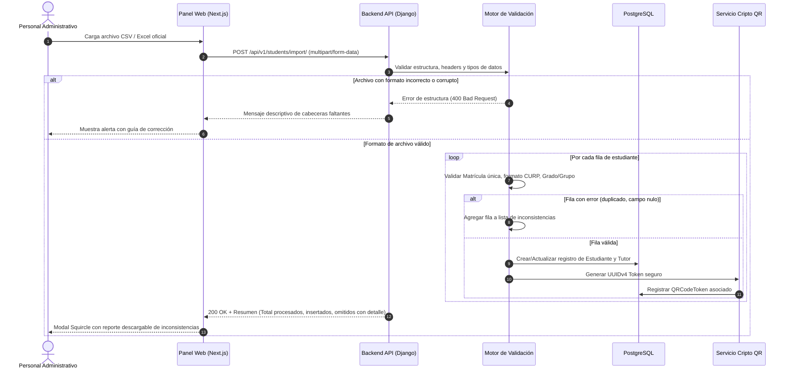
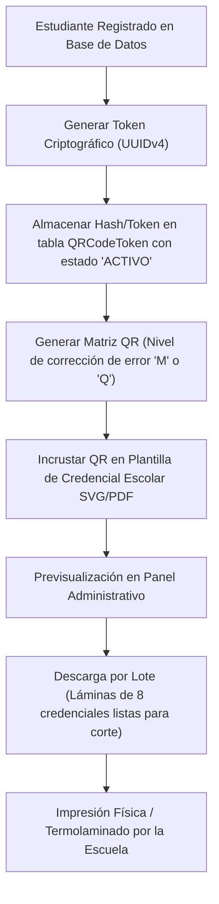
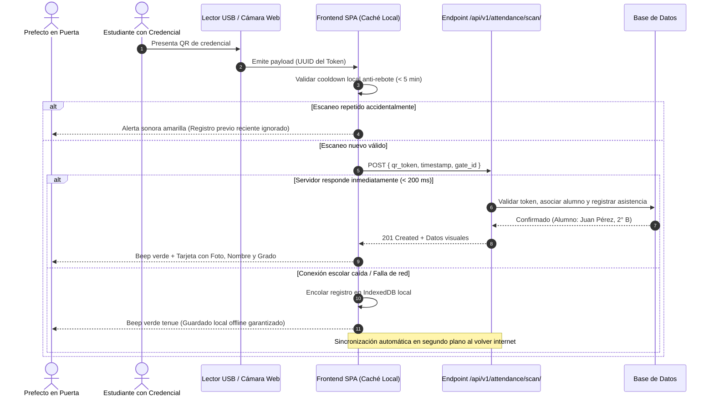

# 01 · Especificación de Requisitos y Flujos Operativos (SIGE)
**Proyecto**: Sistema Integral de Gestión Escolar (Secundaria Mixta 5)  
**Fase de Ciclo de Vida**: Ingeniería de Requisitos & Modelado de Procesos (SDLC Fase 1)  
**Arquitectos de Software**: Ibrahim García & Equipo de Servicio Social  
**Fecha de Publicación**: Septiembre 2026 | **Versión**: 1.0.0

---

## 🧭 1. Introducción y Propósito

Este documento establece la especificación técnica formal de los **flujos operativos, requisitos funcionales (RF), requisitos no funcionales (RNF)** y el **diccionario de datos de ingesta** para el sistema SIGE. 

Constituye la base contractual de ingeniería para la implementación del **Hito 01 (Base Funcional y Generación de QR)** y **Hito 02 (Sistema Web Integrado)**, asegurando que ninguna línea de código se desarrolle sin una trazabilidad funcional validada.

---

## 🔄 2. Modelado de Flujos Operativos Críticos

### 2.1 Flujo 1: Onboarding e Importación Masiva de Estudiantes (Issue #1)
El proceso mediante el cual el personal administrativo o directivo nutre la base de datos a partir de los registros escolares existentes, garantizando atomicidad y validación de calidad previa.

---

### 2.2 Flujo 2: Generación, Emisión y Seguridad del Token QR (Issue #3)

> [!IMPORTANT]
> **Principio de Privacidad y LFPDPPP (Menores de Edad)**:  
> El código QR impreso en la credencial **NUNCA** debe contener datos en texto plano (como nombre, CURP, teléfono del tutor o dirección). Contendrá exclusivamente un **Identificador Opaco Criptográfico (UUIDv4)** firmado digitalmente en base de datos. Si una credencial se extravía físicamente, ningún tercero podrá extraer datos del menor leyendo el código con una cámara convencional.

---

### 2.3 Flujo 3: El Embudo de Asistencia en Puerta (Hito 03 / Issue #6)
Diseñado específicamente para el escenario de alta densidad: 400 a 600 estudiantes ingresando en un lapso de 20 minutos (7:00 AM - 7:20 AM).

---

## 📊 3. Diccionario de Datos: Plantilla Oficial de Captura (CSV / Excel)

Para cumplir el compromiso de la Sección 7 del Acta Constitutiva, la escuela Secundaria Mixta 5 recibirá esta plantilla canónica. Cualquier dato fuera de estas reglas se reportará como excepción sin frenar la importación del resto del lote.

| # | Nombre de Columna | Tipo de Dato | Obligatorio | Formato / Restricción | Ejemplo |
|---|---|---|:---:|---|---|
| 1 | `matricula` | Texto (Alfanumérico) | **SÍ** | 6 a 12 caracteres, único en la escuela | `2026-B-0142` |
| 2 | `curp` | Texto | **SÍ** | 18 caracteres alfanuméricos (Regex oficial RENAPO) | `GARM090314HJC...` |
| 3 | `nombres` | Texto | **SÍ** | 2 a 60 caracteres, mayúsculas | `SAUL IBRAHIM` |
| 4 | `primer_apellido` | Texto | **SÍ** | 2 a 40 caracteres, mayúsculas | `GARCIA` |
| 5 | `segundo_apellido` | Texto | NO | 0 a 40 caracteres, mayúsculas | `OCHOA` |
| 6 | `grado` | Entero | **SÍ** | Valores permitidos: `1`, `2`, `3` | `2` |
| 7 | `grupo` | Texto (1 char) | **SÍ** | Letras mayúsculas: `A`, `B`, `C`, `D`, `E`, `F` | `B` |
| 8 | `turno` | Texto | **SÍ** | `MATUTINO` o `VESPERTINO` | `MATUTINO` |
| 9 | `tutor_nombre` | Texto | **SÍ** | Nombre completo del padre, madre o tutor legal | `MARIA ELENA OCHOA` |
| 10 | `tutor_telefono` | Texto (Numérico) | **SÍ** | 10 dígitos obligatorios (formato celular MX) | `3312345678` |
| 11 | `tutor_parentesco` | Texto | NO | `MADRE`, `PADRE`, `ABUELO/A`, `TUTOR_LEGAL` | `MADRE` |
| 12 | `observaciones_medicas` | Texto | NO | Alergias o condiciones prioritarias para prefectura | `Alérgico a penicilina` |

---

## 🎯 4. Matriz de Requisitos del Sistema (Trazabilidad hacia Hitos 01 y 02)

### 4.1 Requisitos Funcionales (RF)

- **RF-01 (Importación Masiva)**: El sistema debe permitir cargar archivos CSV y XLSX basados estrictamente en el diccionario de datos de la Sección 3, emitiendo un desglose pormenorizado de filas exitosas y filas con errores.
- **RF-02 (Expediente Digital del Estudiante)**: El sistema debe mantener una ficha centralizada con los datos escolares del estudiante, estatus (`ACTIVO`, `BAJA`, `EGRESADO`) y datos del tutor.
- **RF-03 (Generación Criptográfica de QR)**: El sistema debe asociar a cada estudiante un token de identificación seguro único e irrepetible.
- **RF-04 (Exportación de Credenciales)**: El sistema debe generar documentos PDF listos para imprimir en pliegos tamaño carta con las medidas estándar de credencial escolar (85.6 mm × 54 mm), conteniendo foto, datos básicos institucionales y el código QR.
- **RF-05 (Autenticación y Seguridad RBAC)**: El sistema debe proveer autenticación con JWT y control de acceso diferenciado para tres roles:
  1. *Administrador / Directivo*: Control total de estudiantes, usuarios, reportes y configuración.
  2. *Prefecto*: Acceso exclusivo a escaneo de asistencia, consulta rápida de expedientes y registro de incidencias.
  3. *Solo Lectura*: Auditoría y consulta de estadísticas.
- **RF-06 (Prevención de Rebote en Asistencia)**: El motor de asistencia debe ignorar escaneos duplicados del mismo estudiante si ocurren en una ventana menor a 5 minutos.
- **RF-07 (Generador de Notificación de Contingencia)**: El sistema debe incluir un botón "Copiar reporte para WhatsApp" que formatee el estatus de asistencia del alumno con enlace `https://wa.me/<telefono_tutor>?text=...` para envío manual sin costo.

---

### 4.2 Requisitos No Funcionales (RNF)

- **RNF-01 (Rendimiento en Puerta)**: La validación y confirmación visual/auditiva de un código QR debe resolverse en menos de **250 milisegundos** bajo condiciones normales de red local.
- **RNF-02 (Privacidad de Datos de Menores)**: Ningún payload visible del código QR físico debe incluir datos identificables de forma directa (cumplimiento LFPDPPP).
- **RNF-03 (Tolerancia a Desconexión)**: El módulo de escaneo de asistencia debe ser capaz de almacenar en buffer local de navegador hasta **1,000 registros offline** en caso de caída del enlace a internet.
- **RNF-04 (Diseño Visual Squircle & Ergonomía)**: La interfaz de usuario debe implementar curvaturas Squircle (`border-radius: 12px-16px`), contraste tipográfico elevado apto para pantallas con reflejo de sol en puerta, y retroalimentación de color/sonido inmediata.
- **RNF-05 (Compatibilidad de Hardware)**: El módulo de captura de QR debe aceptar lectores USB emuladores de teclado (HID) y cámaras web estándar (UVC) sin requerir instalación de drivers propietarios.
