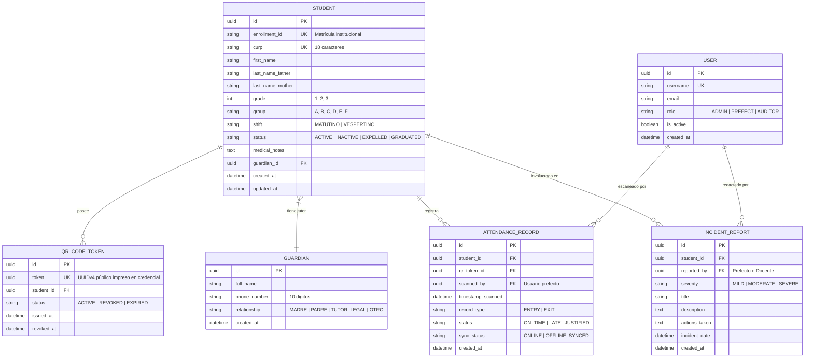

# 02 · Modelo de Datos y Arquitectura de Base de Datos (SIGE)
**Proyecto**: Sistema Integral de Gestión Escolar (Secundaria Mixta 5)  
**Fase de Ciclo de Vida**: Modelado Relacional y Arquitectura Backend (SDLC Fase 2)  
**Motor de Base de Datos**: PostgreSQL 15+ / Django ORM  
**Fecha de Publicación**: Septiembre 2026 | **Versión**: 1.0.0

---

## 🧭 1. Visión y Principios del Modelo

El modelo de datos del SIGE responde directamente a los requerimientos de privacidad (**LFPDPPP**), atomicidad transaccional y prevención de duplicados.

### Principios Fundamentales:
1. **Desacoplamiento Estudiante - Token QR**: La credencial física porta un identificador opaco UUIDv4 (`QRCodeToken`). Si el alumno extravía su credencial, se revoca el token anterior (`status='REVOKED'`) y se genera uno nuevo sin alterar el expediente académico ni la clave única de matrícula.
2. **Normalización del Tutor Legal**: Mapeo relacional que permite asociar un tutor a varios hermanos dentro de la escuela sin duplicar números telefónicos.
3. **Auditoría e Integridad de Asistencia**: Los registros de entrada/salida son inmutables (`created_at`, `timestamp_scanned`). Las modificaciones manuales por parte del prefecto requieren justificación registrada.

---

## 🗄️ 2. Diagrama Entidad-Relación (Mermaid ERD)

---

## 📋 3. Especificación Técnica de Tablas y Constraints

### 3.1 Tabla: `students_student`
- `enrollment_id` (VARCHAR 20, UNIQUE, NOT NULL): Índice principal de búsqueda escolar.
- `curp` (VARCHAR 18, UNIQUE, NOT NULL): Validación en backend mediante regex mexicano.
- `grade` (SMALLINT, NOT NULL, CHECK `grade IN (1, 2, 3)`).
- `group` (CHAR 1, NOT NULL, CHECK `group IN ('A', 'B', 'C', 'D', 'E', 'F')`).
- `status` (VARCHAR 15, DEFAULT `'ACTIVE'`, INDEXADO).

### 3.2 Tabla: `students_qrcodetoken`
- `token` (UUIDv4, UNIQUE, NOT NULL, INDEXADO): **El valor encriptado/opaco que se dibuja en el código QR**.
- Constraint de unicidad activa: Solo puede existir **1 token con `status='ACTIVE'`** simultáneamente por cada `student_id`.

### 3.3 Tabla: `attendance_attendancerecord`
- Índice compuesto: `(student_id, timestamp_scanned)` para consultas de historial aceleradas en milisegundos.
- **Regla de Cooldown a nivel BD**: Previene inserciones si existe un registro del mismo estudiante en los últimos 5 minutos (`WHERE record_type = 'ENTRY' AND timestamp_scanned >= NOW() - INTERVAL '5 MINUTE'`).
