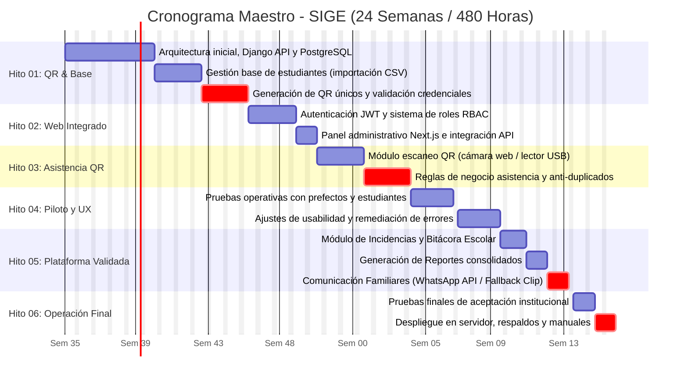
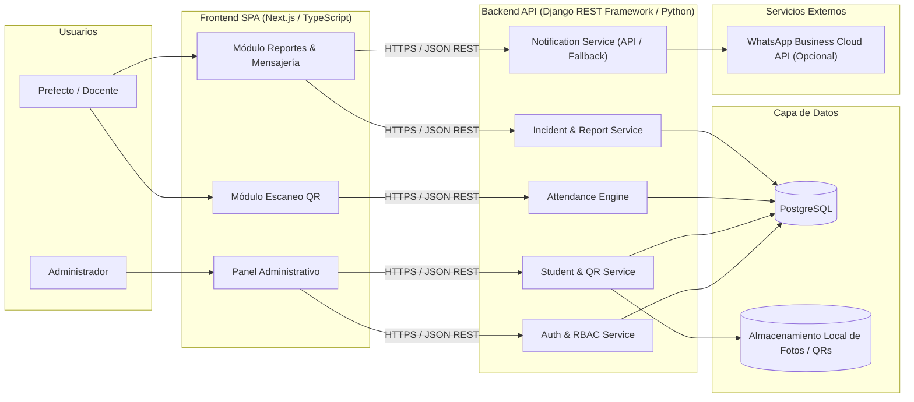

# ACTA CONSTITUTIVA DEL PROYECTO
## Sistema Integral de Gestión Escolar (SIGE)

**Versión 2.0 — Revisada y corregida por el equipo de desarrollo**
**Estado:** Acta constitutiva para aprobación, con correcciones de consistencia, riesgos y supuestos incorporados antes de someterla a la institución.

> **Resumen de cambios respecto a la v1:**
> 1. Plazo de QR alineado entre OE-01 y Hito 01 (8 semanas).
> 2. Módulo de app móvil (aparecía sin definir en Hito 05) retirado hasta pasar por control de cambios.
> 3. OE-07 condicionado explícitamente a la contratación/aprobación real del proveedor de WhatsApp.
> 4. Nueva sección 8.1 — Protección de datos de menores (LFPDPPP).
> 5. Nueva sección 8.2 — Matriz de riesgos y supuestos.
> 6. Nota de capacidad realista sobre las 480 horas disponibles frente al alcance definido.
> 7. Corregida numeración duplicada de la sección "8" del documento original.
> 8. Aclarado el rol de Next.js vs. Django en el stack (ambigüedad de responsabilidades técnicas).
> 9. Agregado punto de control explícito para backend/API/BD (6.9) en los hitos.
> 10. Señalada asimetría: panel administrativo (6.8) y backend (6.9) no tenían objetivo específico propio.
> 11. Agregado KPI propio de desempeño para comunicación con familiares (antes solo cubierto genéricamente).
> 12. Aclarado el tratamiento de datos estructurados (Excel/CSV) para gestión de estudiantes.

---

## 1. Identificación del proyecto

### 1.1 Nombre provisional
Sistema Integral de Gestión Escolar

**Nombre técnico provisional del producto:** SIGE

---

## 2. Propósito del proyecto

El proyecto tiene como propósito establecer una infraestructura tecnológica centralizada, escalable y sostenible que reduzca la dependencia de procesos manuales, facilite el acceso y gestión de la información escolar y siente las bases para la incorporación progresiva de nuevas herramientas y servicios digitales que atiendan las necesidades de la institución.

---

## 3. Problema que se busca resolver

La institución requiere una solución tecnológica que permita modernizar y centralizar diversos procesos de gestión escolar que actualmente pueden depender de herramientas y procedimientos independientes o manuales.

Esta situación dificulta la organización de la información, incrementa la posibilidad de errores, limita la trazabilidad de los procesos y hace más compleja la consulta y generación de información útil para la toma de decisiones.

El proyecto busca atender esta necesidad mediante el desarrollo de una plataforma que integre progresivamente los principales procesos relacionados con:

- administración y consulta de información de estudiantes;
- identificación de estudiantes mediante códigos QR asociados a sus credenciales;
- registro y consulta de asistencia;
- registro y seguimiento de incidencias y comportamiento;
- generación de reportes escolares;
- comunicación de información relevante con los familiares;
- incorporación futura de herramientas y servicios adicionales de gestión escolar.

La solución deberá permitir que estas funcionalidades se desarrollen de manera progresiva sobre una misma infraestructura tecnológica, priorizando aquellas necesidades que representen mayor valor operativo para la institución.

---

## 4. Objetivo general

Desarrollar e implementar una plataforma digital integral para la gestión escolar que permita a la institución centralizar, organizar y automatizar procesos relacionados con la administración de estudiantes, identificación, control de asistencia, seguimiento de incidencias y comportamiento, generación de reportes y comunicación de información relevante a los familiares.

---

## 5. Objetivos específicos

### OE-01 — Identificación y códigos QR
Diseñar, desarrollar y validar un módulo que permita generar un identificador QR único para el 100 % de los estudiantes registrados, asociándolo inequívocamente con su información dentro del sistema y proporcionando los códigos en un formato apto para su incorporación en las credenciales institucionales, dentro de las primeras **ocho (8) semanas** del proyecto.

> ⚠ **Corrección:** el documento original decía "seis semanas" aquí, mientras que el Hito 01 (que contiene esta misma entrega) definía una ventana de semanas 1–8. Se alineó el objetivo específico al hito. Si el equipo prefiere sostener las 6 semanas, es el Hito 01 el que debe acortarse — pero ambos deben decir lo mismo.

### OE-02 — Gestión de estudiantes
Implementar un módulo que permita registrar, consultar, modificar y administrar la información de los estudiantes, garantizando que el 100 % de los estudiantes registrados cuente con un expediente digital único y asociado a su identificador correspondiente antes de la puesta en operación del sistema.

### OE-03 — Gestión de usuarios y permisos
Implementar un sistema de autenticación y autorización que permita gestionar el acceso a la plataforma mediante los roles definidos por la institución, asegurando que cada usuario pueda acceder únicamente a las funciones y datos correspondientes a sus permisos antes de la puesta en operación del sistema.

### OE-04 — Registro de asistencia
Desarrollar e implementar un módulo de control de asistencia que permita registrar automáticamente la entrada y salida de los estudiantes mediante el escaneo de sus códigos QR, almacenando cada registro con información de identificación, fecha y hora, y permitiendo su posterior consulta por parte del personal autorizado.

### OE-05 — Incidencias y comportamiento
Implementar un módulo que permita al personal autorizado registrar, consultar, modificar y dar seguimiento a incidencias relacionadas con el comportamiento de los estudiantes, manteniendo un historial asociado a cada estudiante y permitiendo la generación de información consolidada para su consulta.

### OE-06 — Reportes
Implementar mecanismos para generar y consultar reportes a partir de la información almacenada en el sistema, incluyendo al menos información relacionada con estudiantes, asistencia e incidencias, de acuerdo con las necesidades operativas definidas por la institución.

### OE-07 — Comunicación con familiares
Integrar un mecanismo de comunicación automatizada con los familiares de los estudiantes mediante la plataforma de WhatsApp seleccionada por la institución, permitiendo enviar información y reportes previamente definidos y autorizados, **una vez que los módulos necesarios para generar dicha información se encuentren operativos y el proveedor de mensajería haya sido formalmente contratado y aprobado por la institución.**

> ⚠ **Corrección:** se agregó la condición de contratación/aprobación del proveedor porque WhatsApp Business API tiene costo y requiere aprobación de Meta — es una dependencia externa que puede no resolverse en los tiempos del proyecto. Ver Riesgo R-02 (sección 8.2).

### OE-08 — Calidad, seguridad y continuidad
Implementar mecanismos de validación de datos, control de acceso, protección de información, manejo de errores, pruebas funcionales y respaldo de datos, estableciendo criterios mínimos de calidad y seguridad que deberán cumplirse antes de la puesta en operación de cada módulo.

### OE-09 — Backend, base de datos y API *(nuevo)*
Diseñar e implementar la infraestructura de backend, base de datos y API necesaria para soportar de forma centralizada, segura y escalable el resto de los módulos del sistema, incluyendo mecanismos básicos de manejo de errores y respaldo, disponible de forma incremental desde el Hito 01.

> ⚠ **Adición:** el producto final (6.9) y la matriz de alcance ya incluían este componente, pero ningún objetivo específico lo cubría de forma directa ni tenía punto de control propio en los hitos. Se agrega para cerrar esa asimetría.

### OE-10 — Panel administrativo *(nuevo)*
Implementar una interfaz centralizada que permita al personal autorizado administrar usuarios, estudiantes y módulos disponibles conforme a su rol, consolidando el acceso a las principales funciones operativas del sistema.

> ⚠ **Adición:** mismo caso que OE-09 — el panel administrativo (6.8) tenía componente y fila de alcance propios pero ningún objetivo específico dedicado.

---

## 6. Producto final esperado

El proyecto deberá producir una plataforma integral de gestión escolar, compuesta por los siguientes módulos y componentes principales:

### 6.1 Gestión de estudiantes
- registrar y modificar datos de identificación, como nombre completo, fecha de nacimiento y fotografía;
- registrar información escolar, como grado, grupo, ciclo escolar y matrícula;
- asociar familiares o tutores, incluyendo sus datos de contacto y relación con el estudiante;
- consultar el expediente del estudiante;
- consultar la información relacionada con asistencia e incidencias;
- administrar el estado del estudiante dentro de la institución, como activo, egresado o dado de baja;
- **importación de estudiantes a partir de archivos estructurados (Excel/CSV) que cumplan con un formato definido por el equipo de desarrollo, como mecanismo de alta inicial masiva.** *(aclaración agregada)*

> ⚠ **Aclaración:** el documento original excluía del alcance la carga de datos históricos "no estructurados o que requieran limpieza", pero no aclaraba si datos ya limpios en Excel/CSV sí entraban al alcance como mecanismo de alta. Se aclara aquí: sí entra, siempre que el archivo cumpla un formato definido por el equipo; la limpieza o transformación de datos sigue fuera de alcance.

### 6.2 Gestión de usuarios y permisos
- autenticar usuarios;
- administrar cuentas;
- asignar roles y permisos;
- restringir el acceso a información y funciones según el rol.

### 6.3 Identificación y credenciales
- generación de un código QR único por estudiante;
- asociación del QR con su estudiante correspondiente;
- consulta y validación del identificador;
- generación de los códigos en un formato adecuado para su incorporación a las credenciales físicas.

### 6.4 Control de asistencia
- leer y validar códigos;
- registrar asistencia con fecha y hora;
- consultar registros;
- prevenir registros inválidos o duplicados conforme a las reglas establecidas.

### 6.5 Incidencias y comportamiento
- registrar incidencias;
- consultar y modificar registros;
- mantener un historial asociado a cada estudiante;
- dar seguimiento a los reportes realizados.

### 6.6 Reportes
- registrar y consultar reportes;
- generar información consolidada sobre estudiantes, asistencia e incidencias;
- visualizar la información de acuerdo con los permisos del usuario.

Los reportes serán redactados y registrados manualmente por el personal correspondiente; el sistema se encargará de su almacenamiento, organización y consulta.

### 6.7 Comunicación con familiares
- preparación de información y reportes para envío;
- integración automatizada con el servicio de mensajería seleccionado (sujeto a disponibilidad y contratación del proveedor);
- **mecanismo de contingencia operativo**: generación de mensajes preformateados listos para copiar y pegar (con un clic) para envío directo manual desde WhatsApp Web / WhatsApp Desktop por parte del personal escolar, garantizando la operatividad inmediata a costo cero sin bloquear la entrega.

### 6.8 Panel administrativo
- administrar usuarios y estudiantes;
- consultar información;
- gestionar los módulos disponibles según su rol;
- acceder a las principales funciones operativas del sistema.

*(Ver OE-10, agregado para cubrir este componente con un objetivo específico propio.)*

### 6.9 Backend, base de datos y API
- almacenamiento centralizado de la información;
- lógica de negocio;
- API para comunicación entre aplicaciones;
- control de acceso y validación;
- mecanismos básicos de seguridad, manejo de errores y respaldo.

*(Ver OE-09, agregado para cubrir este componente con un objetivo específico propio y un punto de control explícito en los hitos — sección 11.)*

> ⚠ **Nota sobre módulo móvil retirado:** el documento original mencionaba en el Hito 05 la "integración de la aplicación móvil en las funciones priorizadas", pero ningún componente de app móvil aparece definido aquí ni en la Matriz de alcance (sección 7). Se retiró esa línea del Hito 05 hasta que se defina formalmente como componente 6.10, se dimensione en horas y se someta al proceso de control de cambios (principio 10, sección 9).

---

## 7. Matriz de alcance

| Área | Dentro del alcance | Fuera del alcance |
|---|---|---|
| Gestión de estudiantes | Registro, consulta, modificación y administración de la información de los estudiantes; importación desde archivos estructurados (Excel/CSV) con formato definido. | Carga o incorporación de información histórica no estructurada, o que requiera limpieza, corrección o transformación adicional. |
| Gestión de usuarios | Registro de usuarios, autenticación, gestión de cuentas y asignación de permisos según roles definidos por la institución. | Administración de cuentas externas a la plataforma o sistemas de identidad institucional no contemplados. |
| Gestión de familiares | Registro y asociación de familiares o responsables con los estudiantes; consulta necesaria para comunicación. | Gestión de información familiar no necesaria para la operación del sistema. |
| Identificación mediante QR | Generación de identificadores únicos, asociación con estudiantes, consulta y validación; preparación para credenciales. | Diseño, fabricación, impresión, distribución o reposición física de credenciales. |
| Control de asistencia | Lectura y validación de QR, registro con fecha y hora, consulta de registros, prevención de duplicados. | Desarrollo de dispositivos físicos especializados o sistemas biométricos. |
| Incidencias y comportamiento | Registro, consulta, modificación y seguimiento de incidencias; historial por estudiante. | Automatización de decisiones disciplinarias o evaluación automática del comportamiento. |
| Reportes | Generación, consulta y visualización de reportes redactados manualmente por el personal. | Analítica avanzada, IA o predicción no definida en requerimientos originales. |
| Panel administrativo | Panel web de administración y consulta según rol. | Personalizaciones individuales no esenciales para la operación general. |
| Comunicación con familiares | Integración con el servicio de mensajería seleccionado para envío automatizado de información autorizada. | Costos del servicio externo, campañas masivas, funcionalidades propias de la plataforma de mensajería, canales adicionales no contemplados. |
| Backend y API | Servicios, API y mecanismos de comunicación necesarios para los módulos incluidos. | Integraciones con sistemas externos no aprobados durante la definición del alcance. |
| Base de datos | Diseño, implementación y administración de la base de datos del sistema. | Almacenamiento de información ajena a los procesos contemplados. |
| Seguridad y control | Autenticación, autorización, validación, protección de datos, manejo de errores, respaldo básico. | Certificaciones especializadas o auditorías externas de seguridad. |
| Pruebas y validación | Pruebas funcionales, validación de módulos y corrección de errores antes de operación. | Certificación externa o auditorías independientes. |
| Infraestructura y despliegue | Configuración del entorno tecnológico definido para el proyecto. | Adquisición de equipos físicos, redes institucionales o servidores propios. |
| Mantenimiento y evolución | Corrección de errores derivados de la implementación inicial y ajustes durante la validación. | Desarrollo indefinido de nuevas funcionalidades sin ampliación formal de alcance. |

---

## 8. Condiciones y modalidad de ejecución del proyecto

### Tiempo y recursos humanos

El proyecto dispone de un máximo de **480 horas de trabajo**, distribuidas en 24 semanas × 20 horas/semana del equipo (≈10 horas semanales por integrante, entre dos personas).

> ⚠ **Nota de capacidad realista:** 480 horas entre dos personas a 10 h/semana c/u es un margen ajustado frente al alcance descrito (arquitectura, BD, auth+roles, 6+ módulos funcionales, integración externa de mensajería, pruebas, documentación y despliegue). Cualquier hito que muestre riesgo de incumplimiento por motivos de tiempo deberá resolverse mediante el principio de **control de cambios** (sección 9, punto 10) — ajustando alcance — y no mediante reducción de pruebas, documentación o calidad, ni mediante horas adicionales no contempladas en el acuerdo de servicio social.

El equipo será responsable de: análisis y levantamiento de requisitos; diseño y arquitectura del sistema; desarrollo frontend y backend; diseño e implementación de la base de datos; pruebas y corrección de errores; documentación; despliegue y validación del producto.

Se contempla adicionalmente la participación de usuarios o representantes de la institución para: levantamiento y validación de requisitos; revisión de prototipos y funcionalidades; pruebas de aceptación; retroalimentación sobre el funcionamiento del sistema.

### Modalidad de trabajo

Debido a que el desarrollo del proyecto se realizará como parte de un servicio social, se propone implementar una modalidad de trabajo mixta (presencial y virtual).

**Virtual:** programación, diseño y administración de la base de datos, documentación, diseño de interfaces y prototipos, análisis de requisitos, corrección de errores, pruebas técnicas.

**Presencial:** levantamiento de información de campo, observación de procesos actuales, aclaración y validación de requisitos, reuniones y seguimiento con responsables y usuarios, revisión de prototipos, pruebas de usabilidad y aceptación, recopilación de retroalimentación, identificación y validación de necesidades.

La modalidad propuesta estará sujeta a la autorización y disponibilidad de la institución receptora del servicio social, así como a los horarios y condiciones que ésta establezca.

### Restricción tecnológica — stack base

| Componente | Tecnología |
|---|---|
| Lenguaje principal | TypeScript, Python |
| Framework web | Next.js (frontend), Django (backend/API) |
| Base de datos | PostgreSQL |
| Control de versiones y repositorio | Git + GitHub |

> ⚠ **Corrección:** el documento original listaba "Next.js, Django" como framework web sin aclarar responsabilidades, lo cual sugería mantener dos frameworks full-stack en paralelo — un sobrecosto de horas no justificado para un equipo de 10h/semana por persona. Se aclara la división: **Next.js como frontend, Django como backend/API**, consistente con el componente 6.9. Si el equipo prefiere otra división, debe documentarse explícitamente aquí antes de iniciar desarrollo.

### 8.1 Protección de datos de menores de edad *(sección nueva)*

Debido a que el sistema tratará datos personales de estudiantes menores de edad, se aplicarán medidas mínimas conforme a la Ley Federal de Protección de Datos Personales en Posesión de los Particulares (LFPDPPP) y su reglamento, en particular:

- limitar los campos de datos personales recolectados a los estrictamente necesarios para la operación del sistema (principio de minimización);
- obtener el consentimiento del padre, madre o tutor legal para el tratamiento de los datos del menor, según los medios que defina la institución;
- restringir el acceso a datos de menores exclusivamente al personal autorizado conforme a sus roles;
- evitar la exposición de datos de menores a terceros no contemplados en el alcance (por ejemplo, proveedores de mensajería) más allá de la información estrictamente necesaria para el envío autorizado.

### 8.2 Matriz de riesgos y supuestos *(sección nueva)*

| ID | Riesgo | Prob. | Impacto | Mitigación |
|---|---|---|---|---|
| R-01 | Falta de disponibilidad o retraso en autorización institucional para actividades presenciales | Alta | Alto | Calendarizar reuniones clave con 2 semanas de anticipación; definir punto de contacto único en la institución. |
| R-02 | No aprobación o costo no cubierto del servicio de WhatsApp Business API | Media | Medio | **Contingencia operativa de 2 niveles**: Desacoplar la API oficial de Meta para no bloquear el Hito 05, e incorporar en el panel web un generador de mensajes con botón "Copiar al portapapeles" y enlace directo `wa.me/` para despacho manual inmediato a costo cero. |
| R-03 | Datos históricos de estudiantes no estructurados o incompletos al momento de la carga inicial | Media | Medio | Excluido explícitamente del alcance (sección 7); la institución deberá entregar datos limpios y estructurados, o el proyecto no asume su transformación. |
| R-04 | Capacidad de 10 h/semana por integrante insuficiente frente al alcance total definido | Alta | Alto | Aplicar el principio de control de cambios (sección 9, punto 10): cualquier hito en riesgo se replantea en alcance, no en calidad ni en horas no pagadas. |
| R-05 | Rotación o indisponibilidad de alguno de los dos integrantes del equipo | Baja | Alto | Documentación progresiva (principio 8) como mitigación de continuidad; código y decisiones técnicas versionados en GitHub desde el día uno. |
| R-06 | Tratamiento inadecuado de datos personales de menores de edad | Baja | Alto | Aplicar medidas mínimas conforme a la LFPDPPP (sección 8.1); limitar campos recolectados a los estrictamente necesarios. |
| R-07 | Ambigüedad en la división de responsabilidades entre Next.js y Django genera retrabajo o arquitectura inconsistente | Media | Medio | División de responsabilidades aclarada en el stack base (sección 8): Next.js = frontend, Django = backend/API. |

---

## 9. Principios de desarrollo

1. Valor antes que volumen: se priorizarán funcionalidades que solucionen necesidades reales.
2. Software funcionando como evidencia de progreso.
3. Desarrollo incremental: cada etapa deberá producir un incremento verificable (ver sección 11, Hitos).
4. Validación temprana: las decisiones importantes deberán comprobarse lo antes posible.
5. Simplicidad: evitar funcionalidades y tecnologías innecesarias.
6. Calidad integrada: las pruebas no se dejarán exclusivamente para el final.
7. Seguridad desde el diseño: la información escolar será tratada como información sensible.
8. Documentación progresiva: la documentación crecerá junto con el producto.
9. Mejora continua: al finalizar cada ciclo se identificarán oportunidades de mejora.
10. Control de cambios: ningún cambio importante de alcance se incorporará sin evaluar su impacto en tiempo, riesgo y objetivos.

> ⚠ **Corrección de numeración:** en el documento original, esta sección y la anterior ("Condiciones y modalidad de ejecución") estaban numeradas ambas como "8." Se corrigió la correlación (8 → 9) y se ajustó la numeración de todas las secciones subsecuentes.

---

## 10. Criterio general de éxito

El proyecto se considerará exitoso cuando exista una versión funcional y validada del sistema que permita ejecutar de principio a fin los procesos prioritarios definidos en el alcance, con datos persistentes, control de acceso, registro verificable de operaciones, pruebas documentadas y una versión preparada para su utilización en un entorno real o piloto.

---

## 11. Hitos y niveles de madurez tecnológica

Cada hito permitirá evaluar de manera progresiva el grado de desarrollo, integración, validación y preparación para operación del producto.

### Hito 01 — Base funcional y generación de QR (semanas 1–8)
Contar con una primera versión funcional del sistema capaz de registrar estudiantes y generar un código QR único asociado a cada uno, en un formato adecuado para su incorporación a las credenciales institucionales.

- configuración de la arquitectura inicial **y del esqueleto backend/API (OE-09)**;
- implementación de la base de datos;
- desarrollo de la gestión básica de estudiantes;
- generación y asociación de códigos QR;
- validación de unicidad e integridad de los identificadores;
- pruebas funcionales del flujo de generación;
- generación de una muestra de códigos para validación con la institución.

### Hito 02 — Sistema web integrado (semanas 8–11)
Contar con una versión web integrada que permita administrar estudiantes, usuarios, familiares e identificadores, con autenticación y control de acceso de acuerdo con los roles definidos.

- consolidación de los módulos de gestión;
- implementación de autenticación;
- implementación de roles y permisos;
- integración de módulos con la base de datos **vía la API definida en OE-09**;
- desarrollo del panel administrativo (OE-10);
- pruebas funcionales y de integración.

### Hito 03 — Control de asistencia mediante QR (semanas 11–15)
Contar con un flujo completo de identificación y registro de asistencia mediante los códigos QR previamente generados.

- implementación de lectura de QR;
- validación de identificadores;
- registro de fecha y hora;
- aplicación de reglas de asistencia;
- prevención de registros inválidos o duplicados;
- pruebas de integración;
- pruebas en condiciones controladas con usuarios reales.

### Hito 04 — Validación con usuarios y operación piloto (semanas 16–19)
Validar la facilidad de uso, funcionamiento y comportamiento del sistema mediante pruebas con estudiantes y personal escolar en un entorno representativo de su utilización real.

- pruebas de usabilidad con estudiantes;
- pruebas operativas con personal escolar;
- simulación de jornadas de registro de asistencia;
- identificación y documentación de errores;
- recopilación de retroalimentación;
- ajustes derivados de las pruebas;
- nueva ronda de validación.

### Hito 05 — Plataforma integral validada (semanas 20–22)
Contar con una versión integrada de la plataforma que incorpore los módulos contemplados para la entrega y permita ejecutar de principio a fin los procesos prioritarios definidos en el alcance.

- integración de módulos restantes;
- implementación de incidencias y comportamiento;
- implementación de reportes;
- integración de comunicación con familiares **(sujeta a la disponibilidad del proveedor — ver Riesgo R-02)**;
- pruebas de integración del sistema completo.

> ⚠ **Retiro:** se eliminó la línea "integración de la aplicación móvil en las funciones priorizadas" que aparecía en el documento original: no existe una app móvil definida como componente del producto final (sección 6) ni en la Matriz de alcance (sección 7). Si el equipo la considera necesaria, debe pasar primero por el proceso de control de cambios (principio 10, sección 9).

### Hito 06 — Preparación para operación (semanas 23–24)
Disponer de una versión estable, documentada y preparada para su utilización en un entorno real o piloto, con los mecanismos de seguridad, respaldo, validación y control necesarios.

- pruebas finales de aceptación;
- pruebas de seguridad y control de acceso;
- validación de respaldos y recuperación;
- corrección de errores finales;
- documentación técnica y operativa;
- preparación del entorno de despliegue;
- capacitación inicial de los usuarios designados;
- entrega formal del sistema.

### Criterio de avance entre hitos

El avance hacia un nuevo nivel de madurez estará condicionado al cumplimiento de los criterios de aceptación y KPIs establecidos para el hito anterior. Cuando un hito no alcance los criterios definidos, las actividades de corrección y validación correspondientes deberán priorizarse antes de continuar con funcionalidades que dependan directamente de dicho resultado.

La escala de madurez funcionará como mecanismo de seguimiento y toma de decisiones del proyecto, sin sustituir la planificación detallada de actividades, dependencias y recursos establecida posteriormente mediante la EDT/WBS y el cronograma.

---

## 12. Matriz consolidada de KPIs

| ID | Hito | Indicador | Meta |
|---|---|---|---|
| KPI-01 | Hito 01 | Estudiantes de prueba con QR único asociado | 100 % |
| KPI-02 | Hito 01 | Identificadores duplicados durante las pruebas | 0 |
| KPI-03 | Hito 01 | QR generados correctamente legibles | 100 % |
| KPI-04 | Hito 01 | QR correctamente asociados con su estudiante | 100 % |
| KPI-05 | Hito 01 | Generación de QR dentro del plazo establecido | Máx. 8 semanas |
| KPI-06 | Hito 01 | Aprobación institucional para iniciar producción de credenciales | Aprobado |
| KPI-07 | Hito 02 | Módulos definidos para la etapa integrados | 100 % |
| KPI-08 | Hito 02 | Roles definidos con permisos funcionales | 100 % |
| KPI-09 | Hito 02 | Operaciones críticas con datos persistentes | 100 % |
| KPI-10 | Hito 02 | Errores críticos abiertos al cierre del hito | 0 |
| KPI-11 | Hito 02 | Casos de prueba críticos ejecutados | 100 % |
| KPI-12 | Hito 03 | Lecturas correctas durante las pruebas | ≥ 99 % |
| KPI-13 | Hito 03 | Lecturas válidas asociadas al estudiante correcto | 100 % |
| KPI-14 | Hito 03 | Registros de asistencia asociados a estudiantes inexistentes | 0 |
| KPI-15 | Hito 03 | Registros almacenados con fecha y hora | 100 % |
| KPI-16 | Hito 03 | Duplicados generados en escenarios contemplados | 0 |
| KPI-17 | Hito 03 | Casos críticos de asistencia superados | 100 % |
| KPI-18 | Hito 04 | Participación de la muestra definida | Cumplida |
| KPI-19 | Hito 04 | Tareas principales completadas correctamente | ≥ 90 % |
| KPI-20 | Hito 04 | Valoración positiva de usabilidad | ≥ 80 % |
| KPI-21 | Hito 04 | Errores críticos corregidos antes de avanzar | 100 % |
| KPI-22 | Hito 04 | Escenarios críticos de uso validados | 100 % |
| KPI-23 | Hito 04 | Retroalimentación recopilada y analizada | 100 % |
| KPI-24 | Hito 05 | Módulos incluidos en la versión final integrados | 100 % |
| KPI-25 | Hito 05 | Flujos prioritarios ejecutables de principio a fin | 100 % |
| KPI-26 | Hito 05 | Funcionalidades críticas con pruebas documentadas | 100 % |
| KPI-27 | Hito 05 | Errores críticos abiertos | 0 |
| KPI-28 | Hito 05 | Casos de prueba críticos aprobados | ≥ 95 % |
| **KPI-28b** *(nuevo)* | Hito 05 | Mensajes de WhatsApp entregados correctamente sobre el total enviado en pruebas *(condicionado a resolución de R-02)* | ≥ 95 % |
| KPI-29 | Hito 06 | Criterios de aceptación cumplidos | 100 % |
| KPI-30 | Hito 06 | Roles y permisos validados | 100 % |
| KPI-31 | Hito 06 | Respaldos y procedimientos de recuperación probados | 100 % |
| KPI-32 | Hito 06 | Procesos prioritarios validados | 100 % |
| KPI-33 | Hito 06 | Errores críticos abiertos al momento de la entrega | 0 |
| KPI-34 | Hito 06 | Entregables documentados y entregados | 100 % |
| KPI-35 | Hito 06 | Aprobación de la versión final por parte de la institución | Aprobada |

> ⚠ **Adición:** se agregó KPI-28b porque OE-07 (comunicación con familiares) —el objetivo con mayor dependencia externa (proveedor de WhatsApp)— no tenía ningún indicador de desempeño propio, solo cobertura genérica vía KPI-24 ("módulos integrados"). Este KPI queda condicionado a que R-02 se resuelva; si no se resuelve, se documenta como no aplicable sin bloquear el resto del Hito 05.

---

## 13. Criterio de aceptación del proyecto

El proyecto se considerará formalmente aceptado cuando la versión final del sistema alcance el nivel de madurez establecido para la entrega, cumpla los requisitos y criterios de aceptación definidos para los módulos incluidos en el alcance y exista evidencia verificable de su funcionamiento en un entorno real o piloto.

### 13.1 Funcionalidad
- KPI-07: 100 % de los módulos definidos para la etapa correspondiente integrados.
- KPI-08: 100 % de los roles definidos con permisos funcionales.
- KPI-09: 100 % de las operaciones críticas con datos persistentes.
- KPI-13: 100 % de las lecturas válidas de QR asociadas al estudiante correspondiente.
- KPI-15: 100 % de los registros de asistencia almacenados con fecha y hora.
- KPI-17: 100 % de los casos críticos de asistencia satisfactorios.
- KPI-24 a KPI-26: módulos, flujos y funcionalidades críticas de la versión final íntegramente probados.
- KPI-32: 100 % de los procesos prioritarios validados antes de la entrega.

### 13.2 Calidad y pruebas
- KPI-11, KPI-17, KPI-26, KPI-28: ejecución y aprobación documentada de los casos de prueba críticos (≥ 95 % en la versión final).
- KPI-10, KPI-27, KPI-33: 0 errores críticos abiertos al cierre de los hitos correspondientes y al momento de la entrega final.

### 13.3 Validación con usuarios
- KPI-18 a KPI-23: participación de la muestra definida, ≥ 90 % de tareas completadas correctamente, ≥ 80 % de valoración positiva de usabilidad, corrección de errores críticos, escenarios validados y retroalimentación registrada.

### 13.4 Datos, seguridad y operación
- KPI-08, KPI-09, KPI-30 a KPI-33: roles y permisos validados, datos persistentes, respaldos probados, procesos prioritarios validados, 0 errores críticos al momento de la entrega.

### 13.5 Identificación mediante códigos QR
- KPI-01 a KPI-06: 100 % de estudiantes con QR único, 0 duplicados, 100 % legibles y asociados correctamente, generación dentro del plazo de 8 semanas y aprobación institucional para producción de credenciales.

### 13.6 Comunicación con familiares *(sección nueva)*
- KPI-28b: ≥ 95 % de mensajes entregados correctamente, condicionado a la resolución de R-02 (proveedor de WhatsApp aprobado y contratado). Si el proveedor no está disponible en los tiempos del proyecto, este criterio se documenta como diferido, sin que ello impida la aceptación del resto de los módulos del Hito 05.

### 13.7 Documentación y entrega
La entrega deberá incluir: resultados y evidencias de pruebas; documentación técnica mínima del sistema y su arquitectura; documentación básica para usuarios finales; procedimientos básicos de operación, respaldo y recuperación; evidencia de cumplimiento de los KPI aplicables; demostración integral de los procesos prioritarios (KPI-34).

### 13.8 Aceptación institucional
La aceptación definitiva requerirá la revisión y aprobación de la versión final por parte de los responsables designados por la institución, sustentada en KPI-06, KPI-35 y el cumplimiento de los KPI aplicables a los hitos precedentes.

### 13.9 Regla de aceptación
La aceptación del proyecto completo requerirá, como mínimo:

1. el cumplimiento de los criterios establecidos para cada hito;
2. la validación de los procesos prioritarios;
3. la ausencia de errores críticos abiertos al momento de la entrega;
4. la entrega de la documentación y evidencias correspondientes; y
5. la aprobación institucional de la versión final, conforme al KPI-35.

---

## 14. Cronograma, lista de actividades y recursos de ingeniería de software

### 14.1 Cronograma y Diagrama de Gantt

A continuación se presenta el cronograma maestro estructurado a 24 semanas conforme a los hitos y niveles de madurez tecnológica:

### 14.2 Estructura de Desglose del Trabajo (EDT / WBS)

```mermaid
graph TD
    SIGE["1. Sistema Integral de Gestión Escolar (SIGE)"]
    
    SIGE --> W1["1.1 Gestión Estudiantil"]
    W1 --> W11["1.1.1 Expediente digital"]
    W1 --> W12["1.1.2 Importador estructurado Excel/CSV"]
    W1 --> W13["1.1.3 Motor generador de códigos QR"]

    SIGE --> W2["1.2 Seguridad y Accesos"]
    W2 --> W21["1.2.1 Autenticación (Tokens JWT)"]
    W2 --> W22["1.2.2 Control de acceso basado en roles (RBAC)"]

    SIGE --> W3["1.3 Asistencia Escolar"]
    W3 --> W31["1.3.1 Escáner QR multicanal (Webcam/Lector)"]
    W3 --> W32["1.3.2 Validador y reglas anti-duplicidad"]

    SIGE --> W4["1.4 Gestión de Convivencia"]
    W4 --> W41["1.4.1 Registro manual de incidencias"]
    W4 --> W42["1.4.2 Reportes consolidados e historial"]

    SIGE --> W5["1.5 Comunicación"]
    W5 --> W51["1.5.1 API de mensajería automatizada"]
    W5 --> W52["1.5.2 Generador de mensajes con copia manual"]

    SIGE --> W6["1.6 Infraestructura y Despliegue"]
    W6 --> W61["1.6.1 Backend API Django & DB PostgreSQL"]
    W6 --> W62["1.6.2 Frontend SPA Next.js"]
    W6 --> W63["1.6.3 Respaldos automatizados de BD"]
```

### 14.3 Arquitectura Conceptual del Sistema (C4 Container Level)

---

## 15. Próximos documentos de planificación

Esta acta constituye únicamente el punto de partida del proyecto. A partir de ella se desarrollarán, en este orden:

1. Requisitos funcionales y no funcionales
2. Historias de usuario
3. Criterios de aceptación específicos por requisito
4. Arquitectura del sistema
5. Modelo de datos
6. Estimación de esfuerzo
7. Plan de pruebas y calidad
8. Plan de despliegue
9. Plan de mantenimiento y evolución

---

## 16. Estado del documento

**Estado:** Acta constitutiva para aprobación — versión revisada conjuntamente por el equipo de desarrollo.

El presente documento establece las bases generales del proyecto, incluyendo su propósito, objetivos, alcance, producto esperado, criterios generales de éxito, hitos, niveles de madurez tecnológica, KPIs, riesgos, supuestos y criterios generales de aceptación.

La aprobación de esta acta autorizará el inicio formal de la fase de planificación detallada, durante la cual se desarrollarán y documentarán los requisitos funcionales y no funcionales, historias de usuario, arquitectura del sistema, modelo de datos, EDT/WBS, estimación de esfuerzo, dependencias, ruta crítica, cronograma, matriz de riesgos, plan de pruebas, plan de despliegue y demás elementos necesarios para la ejecución del proyecto.

Los detalles técnicos, estimaciones, fechas específicas de actividades y demás elementos de planificación podrán ser refinados durante dicha fase, siempre que se mantengan consistentes con el propósito, objetivos, alcance y restricciones establecidos en esta acta.

Cualquier modificación sustancial al alcance aprobado deberá someterse al proceso de evaluación y aprobación correspondiente.

---

## Anexo — Registro completo de auditoría (para trazabilidad del siguiente agente)

| # | Hallazgo | Sección afectada | Ajuste aplicado |
|---|---|---|---|
| 1 | OE-01 (6 semanas) contradecía Hito 01 (semanas 1–8) | OE-01, KPI-05 | Unificado a 8 semanas |
| 2 | Módulo de app móvil en Hito 05 sin definición en producto final ni alcance | Hito 05, sección 6 | Retirado; requiere control de cambios para reincorporarse |
| 3 | OE-07 depende de WhatsApp API, cuyo costo está fuera de alcance | OE-07 | Condicionado a contratación/aprobación formal del proveedor |
| 4 | Sin tratamiento específico de datos de menores | Nueva sección 8.1 | Agregada referencia a LFPDPPP y medidas mínimas |
| 5 | Sin matriz de riesgos ni supuestos | Nueva sección 8.2 | Agregada matriz con 7 riesgos (R-01 a R-07) |
| 6 | 480 h para el alcance definido es un margen ajustado, sin mecanismo formal de ajuste | Sección 8 | Nota de capacidad + referencia explícita al principio de control de cambios |
| 7 | Numeración duplicada de la sección "8" en el original | Numeración general | Corregida correlación de todas las secciones |
| 8 | Next.js + Django sin definir responsabilidades | Sección 8 (stack) | Aclarado: Next.js = frontend, Django = backend/API |
| 9 | Backend/API/BD (6.9) sin punto de control explícito en hitos | Hito 01, Hito 02 | Referencias explícitas agregadas |
| 10 | Panel administrativo (6.8) y backend (6.9) sin objetivo específico propio | Sección 5 | Agregados OE-09 y OE-10 |
| 11 | OE-07 sin KPI de desempeño propio (solo cobertura genérica) | Matriz de KPIs | Agregado KPI-28b |
| 12 | Ambigüedad sobre si carga de Excel/CSV estructurado entra al alcance | 6.1, Matriz de alcance | Aclarado: sí entra si cumple formato definido; limpieza de datos sigue fuera |

**Estado de puntos de decisión e ingeniería resueltos:**
- [x] **Importación de datos**: Se diseñará una plantilla estándar oficial Excel/CSV delimitada para la secundaria (Hito 01).
- [x] **Contingencia WhatsApp (R-02)**: Incorporada fallback de portapapeles ("Copiar y pegar mensaje preformateado" + `wa.me/`) en sección 6.7 y matriz de riesgos.
- [x] **Hitos OE-09 y OE-10**: Integrados como puntos de control continuos en Hitos 01 y 02.
- [x] **Cronograma & Recursos de Software (Sección 14)**: Incorporados en Mermaid (Gantt a 24 semanas, WBS/EDT y Diagrama de Contenedores C4).
