# SIGE — Modelo de Datos v2
### Sistema Integral de Gestión Escolar
**Sustituye a:** `02_MODELO_DE_DATOS_Y_ARQUITECTURA_DB.md` (v1.0.0)
**Motor:** PostgreSQL 15+ / Django ORM
**Derivado de:** Catálogo de Reglas de Negocio v2.3 · Especificación de Requisitos v2.3 · Historias de Usuario v1.3 · Criterios de Aceptación v1.3
**Versión:** 2.0 | **Estado:** Para revisión del equipo

---

## 1. Principios del modelo

1. **Desacoplamiento identidad–credencial (RN-QR-01 a 06).** El token QR es una entidad propia y genérica: puede pertenecer a un estudiante o a un docente, nunca a ambos, y un token revocado nunca se reutiliza ni para la misma persona ni para otra.
2. **Normalización del tutor legal (RN-EST-03, RN-EST-11).** Un tutor es una entidad independiente del estudiante, vinculada mediante una tabla intermedia, para que un mismo tutor pueda asociarse a varios hermanos sin duplicar sus datos de contacto.
3. **Inmutabilidad y trazabilidad (RN-AST-06/21, RN-AUT-05, RN-TRX-03/07).** Ningún registro histórico se borra físicamente. Toda modificación manual y todo cambio automático de estado se distinguen por su campo `origin`, y las acciones críticas quedan en `AUDIT_LOG`.
4. **Minimización y control de acceso a datos sensibles (RN-TRX-01/02, RN-EST-12, LFPDPPP).** Los campos de salud y de situación administrativa del estudiante existen como columnas propias, separadas del resto del expediente, para poder filtrarlas por rol sin tocar el resto de la ficha.
5. **Parámetros configurables, no constantes de esquema (RN-ADM-02).** Ninguna regla de negocio variable (ventana de rebote, horas de verificación, tolerancia de puntualidad, política de bloqueo de cuentas) vive como constraint fijo de base de datos; todas son filas de `OPERATIONAL_PARAMETER` editables por el Administrador.
6. **Catálogos, no enumeraciones libres (RF-ADM-01).** Grupos, ciclos escolares, tipos y niveles de gravedad de reporte son tablas administrables, no listas fijas en el código.

---

## 2. Diagrama Entidad-Relación

```mermaid
erDiagram
    ACADEMIC_CYCLE ||--o{ GROUP : "contiene"
    ACADEMIC_CYCLE ||--o{ STUDENT_PENDING_SUBJECT : "ciclo en que se genero"
    
    GROUP ||--o{ STUDENT : "agrupa"
    GROUP ||--o{ TEACHER_GROUP_ASSIGNMENT : ""
    GROUP ||--o{ PREFECT_GROUP_ASSIGNMENT : ""
    GROUP ||--o{ IMPORT_BATCH : "destino de"
    GROUP ||--o{ ATTENDANCE_STUDENT : "grupo vigente al registro"

    USER ||--o| TEACHER : "vinculado a RN-AST-30"
    USER ||--o{ ATTENDANCE_STUDENT : "escaneo / justifico"
    USER ||--o{ ATTENDANCE_STUDENT_EVENT : "escaneo"
    USER ||--o{ ATTENDANCE_TEACHER : "registro / justifico"
    USER ||--o{ INCIDENT_REPORT : "redacto"
    USER ||--o{ REPORT_TRANSITION_LOG : "ejecuto"
    USER ||--o{ IMPORT_BATCH : "cargo"
    USER ||--o{ AUDIT_LOG : "realizo"
    USER ||--o{ OPERATIONAL_PARAMETER : "modifico"
    USER ||--o{ PREFECT_GROUP_ASSIGNMENT : "asignado como prefecto"
    USER ||--o{ QR_TOKEN : "genero/revoco"
    USER ||--o{ STUDENT_PENDING_SUBJECT : "resolvio"
    USER ||--o{ COMMUNICATION_LOG : "reintento"

    STUDENT ||--o{ STUDENT_GUARDIAN : ""
    GUARDIAN ||--o{ STUDENT_GUARDIAN : ""
    STUDENT ||--o{ STUDENT_PENDING_SUBJECT : "debe materias"
    STUDENT ||--o{ QR_TOKEN : "estudiante"
    STUDENT ||--o{ ATTENDANCE_STUDENT : ""
    STUDENT ||--o{ INCIDENT_REPORT : "sujeto de"

    ATTENDANCE_STUDENT ||--o{ ATTENDANCE_STUDENT_EVENT : "eventos adicionales RN-AST-07"

    TEACHER ||--o{ QR_TOKEN : "docente"
    TEACHER ||--o{ TEACHER_SCHEDULE : "programacion"
    TEACHER ||--o{ TEACHER_GROUP_ASSIGNMENT : ""
    TEACHER ||--o{ ATTENDANCE_TEACHER : ""

    REPORT_TYPE ||--o{ INCIDENT_REPORT : ""
    REPORT_SEVERITY ||--o{ INCIDENT_REPORT : ""
    REPORT_TYPE ||--o{ REPORT_PRESET_OPTION : ""
    REPORT_SEVERITY ||--o{ REPORT_PRESET_OPTION : ""
    INCIDENT_REPORT ||--o{ REPORT_SELECTED_OPTION : ""
    REPORT_PRESET_OPTION ||--o{ REPORT_SELECTED_OPTION : ""
    INCIDENT_REPORT ||--o{ REPORT_TRANSITION_LOG : ""
    INCIDENT_REPORT ||--o{ COMMUNICATION_LOG : ""
    INCIDENT_REPORT ||--o{ INCIDENT_REPORT : "reporte nuevo referencia al original RN-REP-08"
    GUARDIAN ||--o{ COMMUNICATION_LOG : "destinatario"

    IMPORT_BATCH ||--o{ IMPORT_ROW_ERROR : ""

    USER {
        uuid id PK
        string username UK
        string password_hash
        string email
        string role
        uuid teacher_id FK
        boolean is_active
        int failed_login_attempts
        datetime locked_until
        datetime created_at
    }

    ACADEMIC_CYCLE {
        uuid id PK
        string name UK
        date start_date
        date end_date
        boolean is_active
    }

    GROUP {
        uuid id PK
        uuid cycle_id FK
        smallint grade
        char group_letter
        string shift
        time cutoff_time
        boolean is_active
    }

    STUDENT {
        uuid id PK
        string enrollment_id UK
        uuid group_id FK
        string first_name
        string last_name_father
        string last_name_mother
        string status
        string completeness
        date birth_date
        string photo_url
        string curp
        string sex
        string address_street
        string address_colonia
        string address_municipio
        string address_estado
        string address_postal_code
        string blood_type
        text allergies
        boolean has_payment_debt
        decimal payment_debt_amount
        datetime created_at
        datetime updated_at
    }

    STUDENT_PENDING_SUBJECT {
        uuid id PK
        uuid student_id FK
        string subject_name
        uuid cycle_id FK
        datetime resolved_at
        uuid resolved_by FK
    }

    GUARDIAN {
        uuid id PK
        string full_name
        string email
        string phone_number
        datetime created_at
    }

    STUDENT_GUARDIAN {
        uuid id PK
        uuid student_id FK
        uuid guardian_id FK
        string relationship
        boolean is_primary_contact
        boolean is_valid_contact
        string invalid_reason
        string consent_status
        date consent_registered_at
    }

    TEACHER {
        uuid id PK
        string internal_id UK
        string full_name
        string status
        string photo_url
        string email
        string phone
        datetime created_at
    }

    TEACHER_SCHEDULE {
        uuid id PK
        uuid teacher_id FK
        smallint weekday
        time expected_entry_time
        time expected_exit_time
        smallint punctuality_tolerance_minutes
        boolean is_active
    }

    TEACHER_GROUP_ASSIGNMENT {
        uuid id PK
        uuid teacher_id FK
        uuid group_id FK
        datetime assigned_at
    }

    PREFECT_GROUP_ASSIGNMENT {
        uuid id PK
        uuid user_id FK
        uuid group_id FK
        datetime assigned_at
    }

    QR_TOKEN {
        uuid id PK
        uuid token UK
        uuid student_id FK
        uuid teacher_id FK
        string status
        string origin
        uuid replaces_token_id FK
        string revoked_reason
        uuid issued_by FK
        uuid revoked_by FK
        datetime issued_at
        datetime revoked_at
    }

    ATTENDANCE_STUDENT {
        uuid id PK
        uuid student_id FK
        uuid group_id FK
        date record_date
        datetime effective_datetime
        string status
        string origin
        string sync_status
        uuid qr_token_id FK
        uuid scanned_by FK
        text justification_reason
        uuid justified_by FK
        datetime created_at
    }

    ATTENDANCE_STUDENT_EVENT {
        uuid id PK
        uuid attendance_record_id FK
        datetime scan_datetime
        uuid qr_token_id FK
        uuid scanned_by FK
    }

    ATTENDANCE_TEACHER {
        uuid id PK
        uuid teacher_id FK
        date record_date
        string record_type
        datetime effective_datetime
        string status
        string origin
        string anomaly_flag
        uuid recorded_by FK
        text justification_reason
        uuid justified_by FK
        datetime created_at
    }

    REPORT_TYPE {
        uuid id PK
        string name UK
        boolean is_active
    }

    REPORT_SEVERITY {
        uuid id PK
        string name UK
        boolean is_active
    }

    REPORT_PRESET_OPTION {
        uuid id PK
        uuid report_type_id FK
        uuid severity_id FK
        string text
    }

    INCIDENT_REPORT {
        uuid id PK
        uuid student_id FK
        uuid reported_by FK
        uuid report_type_id FK
        uuid severity_id FK
        text observation
        string status
        uuid replaces_report_id FK
        text rejection_reason
        text no_communication_reason
        datetime created_at
        datetime updated_at
    }

    REPORT_SELECTED_OPTION {
        uuid id PK
        uuid report_id FK
        uuid preset_option_id FK
    }

    REPORT_TRANSITION_LOG {
        uuid id PK
        uuid report_id FK
        string from_status
        string to_status
        uuid changed_by FK
        text reason
        datetime created_at
    }

    COMMUNICATION_LOG {
        uuid id PK
        uuid report_id FK
        uuid guardian_id FK
        string recipient_email
        text content_snapshot
        string status
        string provider_reference
        datetime attempted_at
        uuid retried_by FK
    }

    IMPORT_BATCH {
        uuid id PK
        uuid uploaded_by FK
        uuid group_id FK
        string filename
        string status
        int total_rows
        int inserted_rows
        int incomplete_rows
        int error_rows
        datetime created_at
        datetime confirmed_at
    }

    IMPORT_ROW_ERROR {
        uuid id PK
        uuid batch_id FK
        int row_number
        string column_name
        string error_type
        text error_description
    }

    AUDIT_LOG {
        uuid id PK
        uuid user_id FK
        string action
        string entity_type
        uuid entity_id
        jsonb previous_value
        jsonb new_value
        string origin
        datetime created_at
    }

    OPERATIONAL_PARAMETER {
        uuid id PK
        string key UK
        string value
        uuid updated_by FK
        datetime updated_at
    }

    BACKUP_LOG {
        uuid id PK
        datetime started_at
        datetime finished_at
        string status
        bigint size_bytes
        text notes
    }
```

---

## 3. Diccionario de datos por tabla

Cada tabla indica su app/modelo Django sugerido, sus columnas relevantes y la regla que sustenta cada decisión de diseño. Los campos de auditoría estándar (`created_at`, `updated_at`) se omiten de la columna "Notas" salvo que tengan una restricción particular.

### 3.1 `USER` (app `accounts`, tabla `accounts_user`)
| Columna | Tipo / Constraint | Regla |
|---|---|---|
| `role` | `STRING` | RN-AUT-01: exactamente un rol activo |
| `teacher_id` | FK a `TEACHER` | RN-AST-30: vínculo 1 a 1 |
| `failed_login_attempts`, `locked_until` | INT, TIMESTAMP | RN-AUT-03: valores no son constantes; el umbral y la duración viven en `OPERATIONAL_PARAMETER` |
| `is_active` | BOOLEAN | RN-EST-04/RN-TRX-03 equivalente para cuentas: se desactiva, nunca se borra |

### 3.2 `ACADEMIC_CYCLE` y `GROUP` (app `catalogs`)
| Columna | Regla |
|---|---|
| `GROUP.cutoff_time` | RN-AST-01: la hora de corte es por grupo y jornada, no global |
| `GROUP.shift` | Tipo STRING. Corresponde a la columna `TURNO` del Excel de origen; ahora es un campo explícito, no implícito por archivo (RN-IMP-08) |

Catálogo administrado exclusivamente por `Administrador` (RN-ADM-01).

### 3.3 `STUDENT` (app `students`)
| Columna | Tipo / Constraint | Regla |
|---|---|---|
| `enrollment_id` | UNIQUE, inmutable a nivel de aplicación | RN-EST-02 |
| `curp` | STRING | RF-EST-01 v2.1: opcional |
| `address_*`, `sex` | STRING | Opcionales (RF-EST-01); mapean 1:1 a `DOMICILIO/COLONIA/MUNICIPIO/ESTADO/C.P.` del Excel |
| `blood_type`, `allergies` | STRING / TEXT | RN-EST-12: salud, opcional y de acceso restringido |
| `has_payment_debt`, `payment_debt_amount` | BOOLEAN, DECIMAL | RN-EST-12: mapea a `DEBE PGO`; sujeto a P3-A-01 (control de cambios pendiente de aprobación institucional) |
| `completeness` | `STRING`, calculado al guardar | RN-EST-10: `INCOMPLETO` si falta `birth_date` o `photo_url` |
| `group_id` | FK | Mínimo obligatorio (RN-EST-10); incluye grado, grupo, ciclo y turno por relación |

**Serializador de API:** los campos `blood_type`, `allergies`, `has_payment_debt`, `payment_debt_amount` y la relación `STUDENT_PENDING_SUBJECT` se excluyen de la respuesta salvo que el rol del solicitante los tenga permitidos (RN-EST-12).

### 3.4 `STUDENT_PENDING_SUBJECT` (app `students`)
Mapea a la columna `DEBE MAT.` del Excel, normalizada: una fila por materia pendiente en vez de un texto libre, para poder marcar cada una como resuelta por separado.

### 3.5 `GUARDIAN` y `STUDENT_GUARDIAN` (app `students`)
| Columna | Regla |
|---|---|
| `GUARDIAN.email`, `GUARDIAN.phone_number` | Ambos STRING; ninguno es obligatorio por sí solo (RN-EST-11) |
| `STUDENT_GUARDIAN.is_valid_contact` | Calculado: `true` si `email` o `phone_number` tiene formato válido y no fue invalidado manualmente |
| `STUDENT_GUARDIAN.consent_status` | Default `PENDIENTE` al crear (RN-EST-07) |
| Relación | `GUARDIAN` no pertenece a un solo `STUDENT`: la tabla intermedia permite que un tutor esté asociado a varios hermanos sin duplicar sus datos |
| `phone_number` | Se guarda tal como se reciba; **no se valida que pertenezca a esa persona en particular** |

**Regla de aplicación (no de columna):** al guardar un `STUDENT`, el backend rechaza la operación si ningún `STUDENT_GUARDIAN` asociado tiene `is_valid_contact = true` (RN-EST-03).

### 3.6 `TEACHER`, `TEACHER_SCHEDULE`, `TEACHER_GROUP_ASSIGNMENT` (app `teachers`)
| Columna | Regla |
|---|---|
| `TEACHER.internal_id` | UNIQUE, inmutable, único también frente a `INACTIVO` (RN-AST-26) |
| `TEACHER.status` | STRING (RN-AST-28: solo `ACTIVO`/`INACTIVO`, nunca se elimina) |
| `TEACHER_SCHEDULE.punctuality_tolerance_minutes` | SMALLINT; si está vacío se usa `OPERATIONAL_PARAMETER['TEACHER_DEFAULT_TOLERANCE_MINUTES']` (RN-AST-14) |
| `TEACHER_GROUP_ASSIGNMENT` | Sustenta `RN-REP-09` para saber a qué docente le llegan reportes de qué grupo |

### 3.7 `QR_TOKEN` (app `credentials`)
| Columna | Constraint | Regla |
|---|---|---|
| `student_id`, `teacher_id` | Ambos FK | RN-QR-05: identificadores independientes por tipo |
| `token` | UNIQUE | RN-QR-03: nunca se reutiliza |
| `replaces_token_id` | Autorreferencia FK | Traza el reemplazo (RN-QR-03) |

### 3.8 `ATTENDANCE_STUDENT` y `ATTENDANCE_STUDENT_EVENT` (app `attendance`)
| Columna | Regla |
|---|---|
| `effective_datetime` | RN-TRX-04: hora del servidor si es en línea, hora de captura corregida si vino de sincronización offline |
| `status` | STRING |
| `origin` | STRING |
| `group_id` | Denormalizado al momento del registro, para que un cambio de grupo posterior no reescriba historial (US-013) |

### 3.9 `ATTENDANCE_TEACHER` (app `attendance`)
| Columna | Regla |
|---|---|
| `anomaly_flag` | STRING |
| `recorded_by` | Debe ser un `USER` con rol adecuado (RN-AST-10) |

### 3.10 Catálogos de reportes y `INCIDENT_REPORT` (app `reports`)
| Columna | Regla |
|---|---|
| `INCIDENT_REPORT.observation` | TEXT |
| `INCIDENT_REPORT.status` | STRING |
| `replaces_report_id` | Autorreferencia FK |
| `REPORT_TRANSITION_LOG` | Una fila por cada cambio de estado (RN-REP-06) |

### 3.11 `COMMUNICATION_LOG` (app `communications`)
| Columna | Regla |
|---|---|
| `content_snapshot` | Guarda exactamente lo que se envió, nunca el expediente completo (RN-COM-02) |
| `status` | STRING |
| `guardian_id` | Debe apuntar a un `STUDENT_GUARDIAN` con `email` válido (RN-COM-01) |

### 3.12 `IMPORT_BATCH` e `IMPORT_ROW_ERROR` (app `imports`)
| Columna | Regla |
|---|---|
| `group_id` | FK |
| `status` | STRING |
| `IMPORT_ROW_ERROR` | Una fila por error, con columna y motivo (RN-IMP-01/03) |

### 3.13 `AUDIT_LOG` (app `audit`)
Tabla de solo inserción (`INSERT`-only a nivel de permisos de base de datos). Registra cambios de rol, modificaciones de asistencia, de reportes y de estatus de estudiante/docente (RN-AUT-05).

### 3.14 `OPERATIONAL_PARAMETER` (app `settings`)
Filas iniciales (semilla): `REBOUND_WINDOW_MINUTES` (5), `STUDENT_ABSENCE_CHECK_TIME` (10:00), `TEACHER_ABSENCE_CHECK_TIME`, `TEACHER_DEFAULT_TOLERANCE_MINUTES` (0), `ACCOUNT_LOCKOUT_MAX_ATTEMPTS` (5), `ACCOUNT_LOCKOUT_DURATION_MINUTES` (15). Editable únicamente por `Administrador` (RN-ADM-02); todo cambio pasa por `AUDIT_LOG`.

### 3.15 `BACKUP_LOG` (app `ops`)
Un registro por corrida del respaldo automático (RN-API-03), consultable por el Administrador.

---

## 4. Restricciones e índices notables (resumen técnico)

| Tabla | Restricción | Motivo |
|---|---|---|
| `TEACHER.internal_id`, `STUDENT.enrollment_id` | `UNIQUE` sin excepción por estatus | Incluye inactivos/bajas |
| `AUDIT_LOG`, `ATTENDANCE_*`, `INCIDENT_REPORT`, `REPORT_TRANSITION_LOG` | Sin permiso de `DELETE` a nivel de rol de base de datos de la aplicación | RN-TRX-03: nada se borra físicamente |

---

## 5. Mapeo del Excel real de origen al modelo

| Columna del Excel | Campo(s) del modelo | Nota |
|---|---|---|
| `NOMBRE` | `STUDENT.first_name` + apellidos (requiere separación en la carga) | — |
| `DOMICILIO`, `COLONIA`, `MUNICIPIO`, `ESTADO`, `C.P.` | `STUDENT.address_street/colonia/municipio/estado/postal_code` | Opcionales |
| `TURNO` | `GROUP.shift` (vía `IMPORT_BATCH.group_id`) | Ya no es un campo del estudiante, sino del grupo del lote (RN-IMP-08) |
| `CURP` | `STUDENT.curp` | Opcional |
| `MATRICULA` | `STUDENT.enrollment_id` | Mínimo, único, inmutable |
| `TELEFONO` (×2) | `GUARDIAN.phone_number` (uno por fila de `STUDENT_GUARDIAN`) | Se acepta tal cual se reciba, sin validar propiedad |
| `NOMBRE MAMA` / `NOMBRE PAPA` | Dos filas de `GUARDIAN` + `STUDENT_GUARDIAN.relationship = MADRE/PADRE` | — |
| `T.SANGRE` | `STUDENT.blood_type` | Acceso restringido (RN-EST-12) |
| `ALERGIAS` | `STUDENT.allergies` | Acceso restringido |
| `DEBE PGO` | `STUDENT.has_payment_debt` (+ `payment_debt_amount` si se captura monto) | Acceso restringido; sujeto a P3-A-01 |
| `DEBE MAT.` | `STUDENT_PENDING_SUBJECT` (una fila por materia, separando el texto por comas) | Acceso restringido |

---

## 6. Estrategia de migraciones

1. **Orden de creación:** catálogos (`ACADEMIC_CYCLE`, `GROUP`, `REPORT_TYPE`, `REPORT_SEVERITY`) y `OPERATIONAL_PARAMETER` primero, con datos semilla; después `USER`/`TEACHER` (por la referencia cruzada, se crea la FK de `USER.teacher_id` en una migración separada posterior a ambas tablas); después `STUDENT`/`GUARDIAN`; el resto en cualquier orden respetando FKs.
2. **Datos semilla obligatorios:** valores iniciales de `OPERATIONAL_PARAMETER` (sección 3.14) y al menos un `ACADEMIC_CYCLE` activo antes de permitir cualquier alta de estudiante o docente.
3. **Migraciones reversibles:** toda migración que agregue una restricción `NOT NULL` sobre una tabla con datos (por ejemplo, si más adelante se vuelve obligatorio algún campo hoy opcional) debe ir en dos pasos: rellenar valores por defecto y luego aplicar la restricción, para no romper el entorno de pruebas con datos ya cargados.
4. **Índices únicos parciales:** requieren migración manual de Django (`RunSQL`) porque el ORM no los genera automáticamente desde `unique=True`; documentar cada uno en el archivo de migración con un comentario que cite la RN correspondiente.
5. **Plan de rollback:** cada migración de datos (no solo de esquema) debe acompañarse de su `reverse_code`; no se aceptan migraciones de datos irreversibles sin respaldo previo (enlaza con `RN-API-03`/`BACKUP_LOG`).

---

## 7. Pendientes explícitos

- **P3-A-01 sin resolver:** los campos `has_payment_debt`, `payment_debt_amount` y `STUDENT_PENDING_SUBJECT` están modelados y listos, pero su inclusión en el alcance del proyecto todavía no tiene aprobación formal de la institución (ver parche de Acta).
- **Separación de `NOMBRE` en apellidos:** el Excel trae el nombre completo en una sola columna; la importación deberá definir una regla de separación (o pedir la corrección a la institución) antes de poder poblar `first_name`/`last_name_father`/`last_name_mother` de forma confiable.
- **Personal administrativo como sujeto de asistencia:** igual que en el plan de arquitectura, el acta menciona la asistencia del personal administrativo (OE-04) pero no existe ningún RF/RN para ello; este modelo no incluye una tabla para esa población todavía.
