# SIGE — Modelo de Datos v3.0
### Sistema Integral de Gestión Escolar
**Sustituye a:** `SIGE_modelo_de_datos_v2_5.md` (etiquetado internamente como versión **2.1** — ver §0, hallazgo A-1)
**Motor:** PostgreSQL 15+ / Django ORM
**Derivado de:** Acta Constitutiva v10 · Especificación de Requisitos (archivo `03_..._v3.md`, etiquetado internamente como **v3.0**) · Catálogo de Reglas de Negocio (archivo `04_..._v3.md`, etiquetado internamente como **v3.0**) · Historias de Usuario v2 · Criterios de Aceptación v2
**Versión:** 3.0 | **Estado:** Para revisión del equipo (auditoría de consistencia documental + adiciones)

---

## 0. Registro de auditoría y cambios (v2.1 → v3.0)

Esta sección documenta, de forma trazable, los hallazgos de la auditoría contra el resto del paquete documental (Acta, Especificación de Requisitos, Reglas de Negocio, Historias de Usuario y Criterios de Aceptación) y qué se hizo con cada uno. No se generó ningún cambio de esquema sin una regla, requisito o historia que lo sustente; donde el propio paquete documental es ambiguo o se contradice a sí mismo, se dejó constancia como **pendiente** (§7) en vez de resolverlo unilateralmente.

### 0.1 Errores de trazabilidad/versionado corregidos
- **A-1.** El encabezado de v2.1 citaba como fuente "RN v2.3 · Especificación v2.3 · HU v1.3 · CA v1.3", versiones que no existen entre los documentos entregados (las versiones reales son RN v2.0, Especificación v2.0, HU v1.1, CA v1.1, más el Acta v9, que no se citaba). Se corrige el encabezado de este documento para reflejar las fuentes reales.

### 0.2 Omisiones estructurales resueltas (tablas nuevas)
- **B-1. Sesiones / tokens de renovación (`USER_SESSION`).** RF-AUT-01 exige que el token de renovación sea "invalidable en caso de cierre de sesión o compromiso de cuenta"; SIGE-US-001 y SIGE-US-004 (HU) exigen además que, al desactivar una cuenta, "el efecto sobre sesiones abiertas sea inmediato (se invalidan sus refresh tokens)" — en plural, es decir, todas las sesiones de un usuario a la vez. Un JWT/refresh token sin persistencia no puede invalidarse selectivamente ni en bloque. Se agrega `USER_SESSION` (§3.1).
- **B-2. Restablecimiento de contraseña (`PASSWORD_RESET_TOKEN`).** RF-AUT-04 y SIGE-US-005 exigen un "enlace de un solo uso... con expiración configurable"; no existía ninguna entidad para persistir ese token, su expiración y si ya fue usado. Se agrega `PASSWORD_RESET_TOKEN` (§3.1).
- **B-3. Historial de consentimiento del tutor (`GUARDIAN_CONSENT_LOG`).** RN-EST-07 exige explícitamente conservar "el estatus vigente **y el historial de cambios con fecha**"; el modelo v2.1 solo guardaba el estatus vigente (`STUDENT_GUARDIAN.consent_status`) y una única fecha, sin poder reconstruir cambios previos (p. ej. `OTORGADO → REVOCADO → OTORGADO`). Se agrega `GUARDIAN_CONSENT_LOG` (§3.5).

### 0.3 Inconsistencias de diseño corregidas o documentadas
- **C-1. Hora de verificación de ausencias estudiantil por turno.** RN-ADM-02 exige que la hora de verificación de ausencias sea posterior a la hora de corte "del **mismo grupo y jornada**", pero `OPERATIONAL_PARAMETER['STUDENT_ABSENCE_CHECK_DEFAULT_TIME']` era un único valor global. Con turnos matutino y vespertino conviviendo (horas de corte muy distintas entre sí), un solo valor global no puede satisfacer esa restricción para ambos. Se resuelve usando dos llaves independientes por turno (§3.14); ver pendiente sobre el valor semilla del turno vespertino (§7).
- **C-2. `REPORT_PRESET_OPTION` sin archivado lógico.** El resto de los catálogos administrables (`GROUP`, `ACADEMIC_CYCLE`, `REPORT_TYPE`, `REPORT_SEVERITY`) tiene `is_active` para desactivarse sin eliminarse (RN-TRX-03, RN-ADM-01), pero `REPORT_PRESET_OPTION` no lo tenía, lo que impediría retirar una opción ya usada en `REPORT_SELECTED_OPTION` históricos sin romper esos registros. Se agrega `is_active` (§3.10).
- **C-3. `STUDENT_GUARDIAN` sin marca de tiempo de alta.** Todas las demás tablas de relación (`TEACHER_GROUP_ASSIGNMENT`, `PREFECT_GROUP_ASSIGNMENT`) tienen `assigned_at`; `STUDENT_GUARDIAN` no tenía ningún timestamp de creación, necesario además para poder sembrar el primer renglón de `GUARDIAN_CONSENT_LOG`. Se agrega `linked_at` (§3.5).
- **C-4. Redacción incorrecta en `TEACHER_GROUP_ASSIGNMENT`.** La nota de v2.1 decía que la tabla sirve "para saber a qué docente le llegan reportes de qué grupo", pero los reportes llegan a los **prefectos** del grupo (`PREFECT_GROUP_ASSIGNMENT`), no a los docentes. `TEACHER_GROUP_ASSIGNMENT` en realidad acota de qué grupos puede un docente **registrar** reportes (RN-REP-09). Se corrige la redacción (§3.6).
- **C-5. Faltaban restricciones aplicativas de rol documentadas.** Se agregan notas explícitas, en paralelo a la ya existente para `USER.teacher_id`, para: `PREFECT_GROUP_ASSIGNMENT.user_id` (debe ser un `USER` con rol `PREFECTO`); alta/edición de `TEACHER_GROUP_ASSIGNMENT` y `PREFECT_GROUP_ASSIGNMENT` (reservada a `Administrador`, RN-ADM-01, no a Personal administrativo); y `QR_TOKEN.issued_by`/`revoked_by` (generación por Administrador o Personal administrativo, revocación exclusiva de Administrador, RF-QR-03/RN-QR-06).
- **C-6. `AUDIT_LOG` no mencionaba inicios de sesión.** RF-AUT-05 exige registrar "inicios de sesión" como parte de la bitácora auditable, y la descripción de §3.13 solo listaba asistencia, reportes y estatus. Se amplía la descripción (§3.13).
- **C-7. Dominio de `REPORT_TRANSITION_LOG.from_status`/`to_status`.** Estaban tipados como `string` libre; se documenta que ambos deben restringirse al mismo dominio de valores que `INCIDENT_REPORT.status`, para que la base de datos no admita transiciones hacia/desde un estado inexistente (§3.10).
- **C-8. Redundancia potencial en `INCIDENT_REPORT`.** Se documenta explícitamente que `rejection_reason` y `no_communication_reason` son una copia de acceso rápido del motivo de la transición vigente — el historial completo y autoritativo vive en `REPORT_TRANSITION_LOG.reason` — para prevenir que ambos se desincronicen sin que nadie lo note (§3.10).

### 0.4 Inconsistencias detectadas que **no** se resuelven en este documento (quedan como pendientes explícitos)
No se tomó una decisión de producto donde el conflicto es entre documentos de negocio/alcance, no un defecto del modelo de datos en sí. Ver el detalle en §7:
- ~~Tensión entre el Acta (excluye "modificación del reglamento escolar desde el sistema") y RF-ADM-01/RN-ADM-01…~~ Resuelto en v3.1: opción A (RN-ADM-03), catálogo fijo sin interfaz de edición.
- RN-REP-02 sigue fijando un conjunto cerrado de exactamente 3 tipos de reporte; con la opción A esto ya no genera tensión, porque el catálogo tampoco es editable en tiempo de ejecución.
- ~~Ningún documento describe cómo evitar crear un GUARDIAN duplicado cuando el mismo tutor ya está asociado a un hermano.~~ Resuelto en v3.1 (RN-EST-13/14, §3.5).

---

## 1. Principios del modelo

1. **Desacoplamiento identidad–credencial (RN-QR-01 a 06).** El token QR es una entidad propia y genérica: puede pertenecer a un estudiante o a un docente, nunca a ambos, y un token revocado nunca se reutiliza ni para la misma persona ni para otra.
2. **Normalización del tutor legal (RN-EST-03, RN-EST-11, RN-EST-13).** Un tutor es una entidad independiente del estudiante, vinculada mediante una tabla intermedia, para que un mismo tutor pueda asociarse a varios hermanos sin duplicar sus datos de contacto; el reconocimiento de un tutor ya existente y la sincronización de sus datos entre hermanos se definen en §3.5 (RN-EST-13, RN-EST-14).
3. **Inmutabilidad y trazabilidad (RN-AST-06/21, RN-AUT-05, RN-TRX-03/07).** Ningún registro histórico se borra físicamente. Toda modificación manual y todo cambio automático de estado se distinguen por su campo `origin`, y las acciones críticas quedan en `AUDIT_LOG`.
4. **Minimización y control de acceso a datos sensibles (RN-TRX-01/02, RN-EST-12, LFPDPPP).** Los campos de salud y de situación administrativa del estudiante existen como columnas propias, separadas del resto del expediente, para poder filtrarlas por rol sin tocar el resto de la ficha.
5. **Parámetros configurables, no constantes de esquema (RN-ADM-02).** Ninguna regla de negocio variable (ventana de rebote, horas de verificación, tolerancia de puntualidad, política de bloqueo de cuentas) vive como constraint fijo de base de datos; todas son filas de `OPERATIONAL_PARAMETER` editables por el Administrador.
6. **Catálogos, no enumeraciones libres (RF-ADM-01).** Grupos, ciclos escolares, tipos y niveles de gravedad de reporte son tablas administrables, no listas fijas en el código. *(Ver pendiente sobre el alcance de esta edición para reportes, §7.)*
7. **Sesiones y credenciales de acceso trazables y revocables (RF-AUT-01, RF-AUT-04).** El token de renovación y el enlace de restablecimiento de contraseña se modelan como entidades propias — nunca como un JWT puramente sin estado — para poder invalidar una sesión individual, todas las sesiones de un usuario a la vez, o un enlace de restablecimiento antes de su expiración natural.
8. **Nombre de persona estructurado (RN-TRX-08 a RN-TRX-10).** Todo nombre de persona se guarda en tres campos (nombre(s), apellido paterno, apellido materno) mediante un mixin común; nunca como texto único ni con separación por inferencia.

---

## 2. Diagrama Entidad-Relación

```mermaid
erDiagram
    ACADEMIC_CYCLE ||--o{ GROUP : "contiene"
    ACADEMIC_CYCLE ||--o{ STUDENT_PENDING_SUBJECT : "ciclo en que se genero"

    GROUP ||--o{ STUDENT : "agrupa"
    GROUP ||--o{ TEACHER_GROUP_ASSIGNMENT : ""
    GROUP ||--o{ PREFECT_GROUP_ASSIGNMENT : ""
    GROUP ||--o{ IMPORT_BATCH : "destino de"
    GROUP ||--o{ ATTENDANCE_STUDENT : "grupo vigente al registro"

    USER ||--o| TEACHER : "vinculado a RN-AST-30"
    USER ||--o{ ATTENDANCE_STUDENT : "escaneo / justifico"
    USER ||--o{ ATTENDANCE_STUDENT_EVENT : "escaneo"
    USER ||--o{ ATTENDANCE_TEACHER : "registro / justifico"
    USER ||--o{ INCIDENT_REPORT : "redacto"
    USER ||--o{ REPORT_TRANSITION_LOG : "ejecuto"
    USER ||--o{ IMPORT_BATCH : "cargo"
    USER ||--o{ AUDIT_LOG : "realizo"
    USER ||--o{ OPERATIONAL_PARAMETER : "modifico"
    USER ||--o{ PREFECT_GROUP_ASSIGNMENT : "asignado como prefecto"
    USER ||--o{ QR_TOKEN : "genero/revoco"
    USER ||--o{ STUDENT_PENDING_SUBJECT : "resolvio"
    USER ||--o{ COMMUNICATION_LOG : "reintento"
    USER ||--o{ USER_SESSION : "posee"
    USER ||--o{ PASSWORD_RESET_TOKEN : "solicito"
    USER ||--o{ GUARDIAN_CONSENT_LOG : "registro"

    STUDENT ||--o{ STUDENT_GUARDIAN : ""
    GUARDIAN ||--o{ STUDENT_GUARDIAN : ""
    STUDENT_GUARDIAN ||--o{ GUARDIAN_CONSENT_LOG : "historial de consentimiento"
    STUDENT ||--o{ STUDENT_PENDING_SUBJECT : "debe materias"
    STUDENT ||--o{ QR_TOKEN : "estudiante"
    STUDENT ||--o{ ATTENDANCE_STUDENT : ""
    STUDENT ||--o{ INCIDENT_REPORT : "sujeto de"

    ATTENDANCE_STUDENT ||--o{ ATTENDANCE_STUDENT_EVENT : "eventos adicionales RN-AST-07"

    TEACHER ||--o{ QR_TOKEN : "docente"
    TEACHER ||--o{ TEACHER_SCHEDULE : "programacion"
    TEACHER ||--o{ TEACHER_GROUP_ASSIGNMENT : ""
    TEACHER ||--o{ ATTENDANCE_TEACHER : ""

    REPORT_TYPE ||--o{ INCIDENT_REPORT : ""
    REPORT_SEVERITY ||--o{ INCIDENT_REPORT : ""
    REPORT_TYPE ||--o{ REPORT_PRESET_OPTION : ""
    REPORT_SEVERITY ||--o{ REPORT_PRESET_OPTION : ""
    INCIDENT_REPORT ||--o{ REPORT_SELECTED_OPTION : ""
    REPORT_PRESET_OPTION ||--o{ REPORT_SELECTED_OPTION : ""
    INCIDENT_REPORT ||--o{ REPORT_TRANSITION_LOG : ""
    INCIDENT_REPORT ||--o{ COMMUNICATION_LOG : ""
    INCIDENT_REPORT ||--o{ INCIDENT_REPORT : "reporte nuevo referencia al original RN-REP-08"
    STUDENT_GUARDIAN ||--o{ COMMUNICATION_LOG : "destinatario"

    IMPORT_BATCH ||--o{ IMPORT_ROW_ERROR : ""

    USER {
        uuid id PK
        string username UK
        string first_name
        string last_name_father
        string last_name_mother
        string password_hash
        string email
        enum role
        uuid teacher_id FK
        boolean is_active
        int failed_login_attempts
        datetime locked_until
        datetime created_at
    }

    USER_SESSION {
        uuid id PK
        uuid user_id FK
        string refresh_token_hash UK
        datetime issued_at
        datetime expires_at
        datetime revoked_at
        enum revoked_reason
    }

    PASSWORD_RESET_TOKEN {
        uuid id PK
        uuid user_id FK
        string token_hash UK
        datetime created_at
        datetime expires_at
        datetime used_at
        datetime invalidated_at
    }

    ACADEMIC_CYCLE {
        uuid id PK
        string name UK
        date start_date
        date end_date
        boolean is_active
    }

    GROUP {
        uuid id PK
        uuid cycle_id FK
        smallint grade
        char group_letter
        enum shift
        time cutoff_time
        boolean is_active
    }

    STUDENT {
        uuid id PK
        string enrollment_id UK
        uuid group_id FK
        string first_name
        string last_name_father
        string last_name_mother
        enum status
        enum completeness
        date birth_date
        string photo_url
        string curp
        string sex
        string address_street
        string address_colonia
        string address_municipio
        string address_estado
        string address_postal_code
        string blood_type
        text allergies
        boolean has_payment_debt
        datetime created_at
        datetime updated_at
    }

    STUDENT_PENDING_SUBJECT {
        uuid id PK
        uuid student_id FK
        string subject_name
        uuid cycle_id FK
        datetime resolved_at
        uuid resolved_by FK
    }

    GUARDIAN {
        uuid id PK
        string first_name
        string last_name_father
        string last_name_mother
        string email
        string phone_number
        datetime created_at
    }

    STUDENT_GUARDIAN {
        uuid id PK
        uuid student_id FK
        uuid guardian_id FK
        enum relationship
        boolean is_primary_contact
        boolean is_valid_contact
        string invalid_reason
        enum consent_status
        date consent_registered_at
        datetime linked_at
    }

    GUARDIAN_CONSENT_LOG {
        uuid id PK
        uuid student_guardian_id FK
        enum previous_status
        enum new_status
        uuid registered_by FK
        datetime registered_at
    }

    TEACHER {
        uuid id PK
        string internal_id UK
        string first_name
        string last_name_father
        string last_name_mother
        enum status
        string photo_url
        string email
        string phone
        datetime created_at
    }

    TEACHER_SCHEDULE {
        uuid id PK
        uuid teacher_id FK
        smallint weekday
        time expected_entry_time
        time expected_exit_time
        smallint punctuality_tolerance_minutes
        boolean is_active
    }

    TEACHER_GROUP_ASSIGNMENT {
        uuid id PK
        uuid teacher_id FK
        uuid group_id FK
        datetime assigned_at
    }

    PREFECT_GROUP_ASSIGNMENT {
        uuid id PK
        uuid user_id FK
        uuid group_id FK
        datetime assigned_at
    }

    QR_TOKEN {
        uuid id PK
        uuid token UK
        uuid student_id FK
        uuid teacher_id FK
        enum status
        enum origin
        uuid replaces_token_id FK
        string revoked_reason
        uuid issued_by FK
        uuid revoked_by FK
        datetime issued_at
        datetime revoked_at
    }

    ATTENDANCE_STUDENT {
        uuid id PK
        uuid student_id FK
        uuid group_id FK
        date record_date
        datetime effective_datetime
        enum status
        enum origin
        enum sync_status
        uuid qr_token_id FK
        uuid scanned_by FK
        text justification_reason
        uuid justified_by FK
        datetime created_at
    }

    ATTENDANCE_STUDENT_EVENT {
        uuid id PK
        uuid attendance_record_id FK
        datetime scan_datetime
        uuid qr_token_id FK
        uuid scanned_by FK
    }

    ATTENDANCE_TEACHER {
        uuid id PK
        uuid teacher_id FK
        date record_date
        enum record_type
        datetime effective_datetime
        enum status
        enum origin
        enum anomaly_flag
        uuid recorded_by FK
        text justification_reason
        uuid justified_by FK
        datetime created_at
    }

    REPORT_TYPE {
        uuid id PK
        string name UK
        boolean is_active
    }

    REPORT_SEVERITY {
        uuid id PK
        string name UK
        boolean is_active
    }

    REPORT_PRESET_OPTION {
        uuid id PK
        uuid report_type_id FK
        uuid severity_id FK
        string text
        boolean is_active
    }

    INCIDENT_REPORT {
        uuid id PK
        uuid student_id FK
        uuid reported_by FK
        uuid report_type_id FK
        uuid severity_id FK
        text observation
        enum status
        uuid replaces_report_id FK
        text rejection_reason
        text no_communication_reason
        datetime created_at
        datetime updated_at
    }

    REPORT_SELECTED_OPTION {
        uuid id PK
        uuid report_id FK
        uuid preset_option_id FK
    }

    REPORT_TRANSITION_LOG {
        uuid id PK
        uuid report_id FK
        enum from_status
        enum to_status
        uuid changed_by FK
        text reason
        datetime created_at
    }

    COMMUNICATION_LOG {
        uuid id PK
        uuid report_id FK
        uuid guardian_id FK
        string recipient_email
        text content_snapshot
        enum status
        string provider_reference
        datetime attempted_at
        uuid retried_by FK
    }

    IMPORT_BATCH {
        uuid id PK
        uuid uploaded_by FK
        uuid group_id FK
        string filename
        enum status
        int total_rows
        int inserted_rows
        int incomplete_rows
        int error_rows
        datetime created_at
        datetime confirmed_at
    }

    IMPORT_ROW_ERROR {
        uuid id PK
        uuid batch_id FK
        int row_number
        string column_name
        string error_type
        text error_description
    }

    AUDIT_LOG {
        uuid id PK
        uuid user_id FK
        string action
        string entity_type
        uuid entity_id
        jsonb previous_value
        jsonb new_value
        enum origin
        datetime created_at
    }

    OPERATIONAL_PARAMETER {
        uuid id PK
        string key UK
        string value
        uuid updated_by FK
        datetime updated_at
    }

    BACKUP_LOG {
        uuid id PK
        datetime started_at
        datetime finished_at
        enum status
        enum offsite_status
        bigint size_bytes
        text notes
    }
```

---

## 3. Diccionario de datos por tabla

Cada tabla indica su app/modelo Django sugerido, sus columnas relevantes y la regla que sustenta cada decisión de diseño. Los campos de auditoría estándar (`created_at`, `updated_at`) se omiten de la columna "Notas" salvo que tengan una restricción particular.

### 3.0 Convención de nombre de persona (transversal: `USER`, `STUDENT`, `TEACHER`, `GUARDIAN`)
Las cuatro entidades guardan el nombre con el mismo grupo de columnas, definido una sola vez como *mixin* abstracto de Django (`PersonNameMixin`), para que la futura entidad de personal administrativo (§8) lo reutilice sin cambios.
 
| Columna | Tipo / Constraint | Regla |
|---|---|---|
| `first_name` | `VARCHAR(60) NOT NULL` | Nombre(s); obligatorio (RN-TRX-08) |
| `last_name_father` | `VARCHAR(60) NOT NULL` | Apellido paterno; obligatorio |
| `last_name_mother` | `VARCHAR(60) NULL` | Apellido materno; opcional. Vacío se guarda como `NULL` (nunca cadena vacía ni valor sustituto) |
 
- **Nivel base de datos:** `CHECK (char_length(first_name) BETWEEN 2 AND 60)` y lo mismo para `last_name_father`; `CHECK (last_name_mother IS NULL OR char_length(last_name_mother) BETWEEN 2 AND 60)`.
- **Nivel aplicación (validador compartido):** caracteres permitidos, valores sustitutos y normalización de espacios (RN-TRX-09).
- **No se almacena `full_name`.** La API expone `display_name` («Nombre(s) Apellido paterno Apellido materno») y `sort_name` calculados (RN-TRX-10).
- **Búsqueda:** extensión `unaccent` de PostgreSQL (migración `CREATE EXTENSION IF NOT EXISTS unaccent`); comparación por tokens sobre los tres campos con `unaccent(lower(...))`.
- **Ningún campo de nombre es `UNIQUE`.**
- **Independencia:** el nombre de un `USER` y el del `TEACHER` vinculado (RN-AST-30) son independientes; ninguno se copia al otro.
- Si ya existieran datos cargados con `full_name` (no debería: el modelo sigue en revisión), la separación se hace manualmente; nunca por heurística.

### 3.1 `USER`, `USER_SESSION` y `PASSWORD_RESET_TOKEN` (app `accounts`, tabla `accounts_user`)
| Columna | Tipo / Constraint | Regla |
|---|---|---|
| `USER.role` | `ENUM('ADMINISTRADOR', 'PREFECTO', 'DOCENTE', 'PERSONAL_ADMINISTRATIVO', 'SOLO_LECTURA')` | RN-AUT-01, RN-AUT-06: exactamente un rol activo |
| `USER.teacher_id` | FK a `TEACHER` | RN-AST-30: vínculo 1 a 1 |
| `USER.failed_login_attempts`, `USER.locked_until` | INT, TIMESTAMP | RN-AUT-03: valores no son constantes; el umbral y la duración viven en `OPERATIONAL_PARAMETER` |
| `USER.is_active` | BOOLEAN | RN-EST-04/RN-TRX-03 equivalente para cuentas: se desactiva, nunca se borra |
| `USER_SESSION.refresh_token_hash` | UNIQUE | Se guarda el **hash** del token de renovación, nunca el valor en claro (mismo criterio que `password_hash`); RF-AUT-01 |
| `USER_SESSION.revoked_at`, `revoked_reason` | TIMESTAMP, `ENUM('LOGOUT', 'ADMIN_INVALIDATION', 'PASSWORD_RESET', 'EXPIRED')` | RF-AUT-01: invalidación al cerrar sesión o por compromiso de cuenta; SIGE-US-004: al desactivar una cuenta, **todas** sus sesiones (`WHERE user_id = ... AND revoked_at IS NULL`) se marcan `ADMIN_INVALIDATION` en el mismo momento |
| `PASSWORD_RESET_TOKEN.token_hash` | UNIQUE | RF-AUT-04: enlace de un solo uso; se guarda el hash, no el token en claro, por el mismo criterio de seguridad que `USER_SESSION` |
| `PASSWORD_RESET_TOKEN.expires_at`, `used_at`, `invalidated_at` | TIMESTAMP, TIMESTAMP NULLABLE, TIMESTAMP NULLABLE | RF-AUT-04: expiración configurable; `used_at` distingue un enlace ya consumido de uno solo vencido; `invalidated_at` distingue un enlace reemplazado por uno nuevo (RN-AUT-07) de uno vencido por su cuenta, sin necesitar borrarlo (RN-TRX-03) |
| `USER.first_name`, `USER.last_name_father`, `USER.last_name_mother` | Ver §3.0 | US-003 exige el nombre del titular de la cuenta (v3.0 no tenía ningún campo de nombre en `USER`); RN-TRX-08 |

> **Constraint aplicativo (no de columna):** un `CHECK` a nivel de aplicación impide guardar `teacher_id` si `role != 'DOCENTE'`.
> **Constraint aplicativo (no de columna):** al emitir un `PASSWORD_RESET_TOKEN` nuevo, la aplicación marca `invalidated_at = now()` en todo `PASSWORD_RESET_TOKEN` del mismo usuario con `used_at IS NULL` y `expires_at > now()` (RN-AUT-07). Un enlace se acepta solo si `used_at IS NULL AND invalidated_at IS NULL AND expires_at > now()`.
> **Constraint aplicativo (no de columna):** al completar un restablecimiento de contraseña (`PASSWORD_RESET_TOKEN.used_at` se llena), la aplicación invalida también toda `USER_SESSION` vigente de ese usuario (`revoked_reason = 'PASSWORD_RESET'`), conforme al flujo alterno de SIGE-US-005 ("al completar el cambio se invalidan las sesiones previas").

### 3.2 `ACADEMIC_CYCLE` y `GROUP` (app `catalogs`)
| Columna | Tipo / Constraint | Regla |
|---|---|---|
| `GROUP.cutoff_time` | TIME | RN-AST-01: la hora de corte es por grupo y jornada, no global |
| `GROUP.shift` | `ENUM('MATUTINO', 'VESPERTINO')` | RF-EST-01: corresponde a la columna `TURNO` del Excel de origen; es un campo explícito, no implícito por archivo (RN-IMP-08) |

Catálogo administrado exclusivamente por `Administrador` (RN-ADM-01).

### 3.3 `STUDENT` (app `students`)
| Columna | Tipo / Constraint | Regla |
|---|---|---|
| `enrollment_id` | UNIQUE, inmutable a nivel de aplicación | RN-EST-02 |
| `status` | `ENUM('ACTIVO', 'BAJA', 'EGRESADO')` | RN-EST-01 |
| `curp` | STRING | RF-EST-01 v2.1: opcional |
| `address_*`, `sex` | STRING | Opcionales (RF-EST-01); mapean 1:1 a `DOMICILIO/COLONIA/MUNICIPIO/ESTADO/C.P.` del Excel |
| `blood_type`, `allergies` | STRING / TEXT | RN-EST-12: salud, opcional y de acceso restringido |
| `has_payment_debt` | BOOLEAN | RN-EST-12: indicador de adeudo de pago (sí/no), mapea a `DEBE PGO`; alcance aprobado (Acta v10, §7.1, CC-01). No se almacena monto (RN-TRX-01) |
| `completeness` | `ENUM('COMPLETO', 'INCOMPLETO')`, calculado al guardar | RN-EST-10: `INCOMPLETO` si falta `birth_date` o `photo_url` |
| `group_id` | FK | Mínimo obligatorio (RN-EST-10); incluye grado, grupo, ciclo y turno por relación |

**Serializador de API:** los campos `blood_type`, `allergies`, `has_payment_debt` y la relación `STUDENT_PENDING_SUBJECT` se excluyen…

### 3.4 `STUDENT_PENDING_SUBJECT` (app `students`)
Mapea a la columna `DEBE MAT.` del Excel, normalizada: una fila por materia pendiente en vez de un texto libre, para poder marcar cada una como resuelta por separado.

### 3.5 `GUARDIAN`, `STUDENT_GUARDIAN` y `GUARDIAN_CONSENT_LOG` (app `students`)
| Columna | Tipo / Constraint | Regla |
|---|---|---|
| `GUARDIAN.first_name/last_name_father/last_name_mother` | Ver §3.0 | RN-TRX-08 (nombre estructurado, no `full_name`)
| `GUARDIAN.email`, `GUARDIAN.phone_number` | Ambos STRING; ninguno es obligatorio por sí solo | RN-EST-11 |
| `STUDENT_GUARDIAN.relationship` | `ENUM('MADRE', 'PADRE', 'TUTOR_LEGAL', 'OTRO')` | RN-EST-03 |
| `STUDENT_GUARDIAN.is_valid_contact` | Calculado | `true` si `email` o `phone_number` tiene formato válido y no fue invalidado manualmente |
| `STUDENT_GUARDIAN.consent_status` | `ENUM('PENDIENTE', 'OTORGADO', 'REVOCADO')` | RN-EST-07: default `PENDIENTE` al crear |
| `STUDENT_GUARDIAN.linked_at` | DATETIME | *(Nuevo en v3, hallazgo C-3)* Momento en que el tutor quedó asociado al estudiante; sirve además como base del primer renglón de `GUARDIAN_CONSENT_LOG` |
| `STUDENT_GUARDIAN` | `UNIQUE(student_id, guardian_id)` | Evita vincular dos veces al mismo tutor con el mismo estudiante |
| Relación | FK | `GUARDIAN` no pertenece a un solo `STUDENT`: la tabla intermedia permite que un tutor esté asociado a varios hermanos sin duplicar sus datos |
| `phone_number` | STRING | Se guarda tal como se reciba; **no se valida que pertenezca a esa persona en particular** |
| `GUARDIAN_CONSENT_LOG.previous_status` / `new_status` | Ambos `ENUM('PENDIENTE', 'OTORGADO', 'REVOCADO')`; `previous_status` NULLABLE (nulo en el primer renglón) | *(Nuevo en v3, hallazgo B-3)* RN-EST-07: "se conserva el estatus vigente y el historial de cambios con fecha"; `STUDENT_GUARDIAN.consent_status` sigue siendo la fuente del estatus vigente (consulta rápida), `GUARDIAN_CONSENT_LOG` es el historial completo |
| `GUARDIAN_CONSENT_LOG.registered_by` | FK a `USER`, NULLABLE | Nulo cuando el renglón inicial se generó automáticamente en `PENDIENTE` al crear el tutor; con valor cuando Personal administrativo o Administrador registra un cambio (matriz RN-AUT-06) |

**Regla de aplicación (no de columna):** al guardar un `STUDENT`, el backend rechaza la operación si ningún `STUDENT_GUARDIAN` asociado tiene `is_valid_contact = true` (RN-EST-03).

**Regla de aplicación (no de columna):** toda escritura en `STUDENT_GUARDIAN.consent_status` DEBE generar, en la misma transacción, un renglón en `GUARDIAN_CONSENT_LOG` con el valor anterior y el nuevo (RN-EST-07).

**Regla de aplicación (no de columna):** al recibir una edición de `GUARDIAN.first_name`, `last_name_father`, `last_name_mother`, `email` o `phone_number`, el backend cuenta las filas de `STUDENT_GUARDIAN` asociadas a ese `guardian_id`; si son 2 o más, la API responde primero con la lista de estudiantes afectados para que la interfaz muestre el aviso (RN-EST-14), y solo aplica el `UPDATE` (una sola fila de `GUARDIAN`, visible de inmediato para todos los vínculos) cuando la petición trae la confirmación explícita.

**Regla de aplicación (no de columna):** "separar un tutor" (RF-EST-07) crea un nuevo `GUARDIAN` con una copia de los datos vigentes, mueve a él el o los renglones de `STUDENT_GUARDIAN` señalados, y dispara un nuevo `GUARDIAN_CONSENT_LOG` inicial en `PENDIENTE` para esos vínculos (mismo criterio que un alta nueva, RN-EST-07); el `GUARDIAN` original y sus demás vínculos no se modifican.

> **Resuelto en v3.1:** el criterio de coincidencia fuerte para reutilizar un GUARDIAN existente es nombre completo + (correo o teléfono) — RN-EST-13. La reutilización nunca modifica los datos de un tutor ya existente durante la importación (RN-IMP-10); en alta manual, el usuario confirma o declina la sugerencia. Editar un tutor compartido dispara aviso previo y sincronización (RN-EST-14, §3.5 más abajo).

### 3.6 `TEACHER`, `TEACHER_SCHEDULE`, `TEACHER_GROUP_ASSIGNMENT` (app `teachers`)
| Columna | Tipo / Constraint | Regla |
|---|---|---|
| `TEACHER.internal_id` | UNIQUE, inmutable, único también frente a `INACTIVO` | RN-AST-26 |
| `TEACHER.status` | `ENUM('ACTIVO', 'INACTIVO')` | RN-AST-28: solo `ACTIVO`/`INACTIVO`, nunca se elimina |
| `TEACHER_SCHEDULE.punctuality_tolerance_minutes` | SMALLINT | Si está vacío se usa `OPERATIONAL_PARAMETER['TEACHER_DEFAULT_TOLERANCE_MINUTES']` (RN-AST-14) |
| `TEACHER_GROUP_ASSIGNMENT` | FK | Determina de qué grupos puede un docente **registrar reportes**; el reporte en sí se envía a los prefectos asignados al grupo del estudiante vía `PREFECT_GROUP_ASSIGNMENT` (RN-REP-09) *(redacción corregida en v3, hallazgo C-4: la versión anterior decía, de forma incorrecta, que esta tabla determina a qué docente "le llegan" los reportes)* |
| `TEACHER.first_name`, `TEACHER.last_name_father`, `TEACHER.last_name_mother` | Ver §3.0 (reemplazan a `full_name`) | RN-AST-27, RN-TRX-08 |

> **Constraint aplicativo (no de columna):** el alta, edición o baja de un renglón de `TEACHER_GROUP_ASSIGNMENT` o `PREFECT_GROUP_ASSIGNMENT` está reservada al rol `Administrador` (RN-ADM-01: son catálogos/asignaciones institucionales); Personal administrativo puede editar la ficha y programación del docente (`TEACHER`, `TEACHER_SCHEDULE`), pero no estas asignaciones. *(Nuevo en v3, hallazgo C-5.)*
> **Constraint aplicativo (no de columna):** `PREFECT_GROUP_ASSIGNMENT.user_id` debe referenciar a un `USER` con `role = 'PREFECTO'` (mismo patrón que el `CHECK` aplicativo de `USER.teacher_id`). *(Nuevo en v3, hallazgo C-5.)*

### 3.7 `QR_TOKEN` (app `credentials`)
| Columna | Tipo / Constraint | Regla |
|---|---|---|
| `student_id`, `teacher_id` | Ambos FK | RN-QR-05: identificadores independientes por tipo; `CHECK (num_nonnulls(student_id, teacher_id) = 1)` garantiza que pertenezca a exactamente uno de los dos (mismo comportamiento que antes; se escribe así para que sumar una tercera población sea solo ampliar la lista de columnas, ver §8) |
| `token` | UNIQUE | RN-QR-03: nunca se reutiliza |
| `status` | `ENUM('VIGENTE', 'REVOCADO')` | RN-QR-03 |
| `origin` | `ENUM('ALTA_INICIAL', 'REEMPLAZO')` | RN-QR-03 |
| `replaces_token_id` | Autorreferencia FK | Traza el reemplazo (RN-QR-03) |
| `issued_by` | FK a `USER` | Debe tener rol `ADMINISTRADOR` o `PERSONAL_ADMINISTRATIVO` (generación de QR de estudiantes o docentes, RF-QR-04) *(nota agregada en v3, hallazgo C-5)* |
| `revoked_by` | FK a `USER` | Debe tener rol `ADMINISTRADOR` exclusivamente (revocación y regeneración, RF-QR-03, RN-QR-06) *(nota agregada en v3, hallazgo C-5)* |

### 3.8 `ATTENDANCE_STUDENT` y `ATTENDANCE_STUDENT_EVENT` (app `attendance`)
| Columna | Tipo / Constraint | Regla |
|---|---|---|
| `effective_datetime` | TIMESTAMP | RN-TRX-04: hora del servidor si es en línea, hora de captura corregida si vino de sincronización offline |
| `status` | `ENUM('ASISTIO', 'LLEGO_TARDE', 'FALTO', 'FALTA_JUSTIFICADA')` | RN-AST-22 |
| `origin` | `ENUM('ESCANEO', 'AUTOMATICO', 'MANUAL')` | RN-TRX-07 |
| `sync_status` | `ENUM('ONLINE', 'OFFLINE_SYNCED')` | RN-MOV-02 |
| `group_id` | FK | Denormalizado al momento del registro, para que un cambio de grupo posterior no reescriba historial (US-013) |
| `justification_reason`, `justified_by` | TEXT, FK | Reflejan la justificación **vigente**; el histórico completo de valor anterior/nuevo, usuario y fecha vive en `AUDIT_LOG` (RN-AST-05) |

### 3.9 `ATTENDANCE_TEACHER` (app `attendance`)
| Columna | Tipo / Constraint | Regla |
|---|---|---|
| `record_type` | `ENUM('ENTRADA', 'SALIDA')` | RN-AST-12 |
| `status` | `ENUM('ASISTIO', 'LLEGO_TARDE', 'FALTO', 'FALTA_JUSTIFICADA')` (NULL permitido en `SALIDA`) | RN-AST-14 |
| `origin` | `ENUM('ESCANEO', 'AUTOMATICO', 'MANUAL')` | RN-TRX-07 |
| `anomaly_flag` | `ENUM('NINGUNA', 'SALIDA_SIN_ENTRADA')` | RN-AST-25 |
| `recorded_by` | FK | Debe ser un `USER` con rol adecuado (RN-AST-10) |

### 3.10 Catálogos de reportes e `INCIDENT_REPORT` (app `reports`)
| Columna | Tipo / Constraint | Regla |
|---|---|---|
| `REPORT_PRESET_OPTION.is_active` | BOOLEAN | *(Nuevo en v3, hallazgo C-2)* Permite retirar una opción del reglamento sin eliminarla, preservando la integridad de `REPORT_SELECTED_OPTION` ya creados (RN-TRX-03, RN-ADM-01) |
| `INCIDENT_REPORT.observation` | TEXT | `CHECK (char_length(observation) BETWEEN 50 AND 100)` (RN-REP-01) |
| `INCIDENT_REPORT.status` | `ENUM('REGISTRADO', 'REVISADO_PREFECTO', 'CANALIZADO', 'REVISADO_ADMINISTRATIVO', 'RECHAZADO', 'AUTORIZADO', 'COMUNICADO', 'RESUELTO')` | RN-REP-03, RN-REP-07 |
| `INCIDENT_REPORT.rejection_reason`, `no_communication_reason` | TEXT | Copia de acceso rápido del motivo de la transición vigente; el registro autoritativo de motivo por cada cambio de estado vive en `REPORT_TRANSITION_LOG.reason` *(aclaración agregada en v3, hallazgo C-8, para evitar que ambos se desincronicen sin control)* |
| `replaces_report_id` | Autorreferencia FK | Traza reemplazos por correcciones |
| `REPORT_TRANSITION_LOG.from_status`, `to_status` | `ENUM` — mismo dominio de valores que `INCIDENT_REPORT.status` | Una fila por cada cambio de estado (RN-REP-06); *(tipo corregido en v3, hallazgo C-7: antes eran `STRING` libre, sin garantía de que solo contuvieran valores válidos del flujo)* |

> **Resuelto en v3.1 (opción A):** REPORT_TYPE, REPORT_SEVERITYyREPORT_PRESET_OPTIONson fijos, sembrados en la instalación inicial y sin interfaz de edición para ningún rol (RN-ADM-03, Acta §7.1 CC-03). Las tablas se mantienen sin cambio de esquema, únicamente para preservar la integridad referencial deINCIDENT_REPORT/REPORT_SELECTED_OPTION; un ajuste futuro de contenido se hace por migración de datos versionada, no por interfaz.

### 3.11 `COMMUNICATION_LOG` (app `communications`)
| Columna | Tipo / Constraint | Regla |
|---|---|---|
| `content_snapshot` | TEXT | Guarda exactamente lo que se envió, nunca el expediente completo (RN-COM-02) |
| `status` | `ENUM('PENDIENTE', 'ENVIADO', 'FALLIDO')` | RN-COM-03 |
| `guardian_id` | FK a `STUDENT_GUARDIAN` | Apunta a la relación `STUDENT_GUARDIAN` con `email` válido (RN-COM-01, RN-COM-04) para contextualizar la notificación por estudiante y tutor |

### 3.12 `IMPORT_BATCH` e `IMPORT_ROW_ERROR` (app `imports`)
| Columna | Tipo / Constraint | Regla |
|---|---|---|
| `group_id` | FK | Grupo destino de la importación |
| `status` | `ENUM('VALIDANDO', 'VISTA_PREVIA', 'CONFIRMADO', 'CANCELADO')` | RN-IMP-04 |
| `IMPORT_ROW_ERROR` | FK | Una fila por error, con columna y motivo (RN-IMP-01/03) |

### 3.13 `AUDIT_LOG` (app `audit`)
Tabla de solo inserción (`INSERT`-only a nivel de permisos de base de datos). Registra **inicios de sesión (exitosos y fallidos)**, cambios de rol, modificaciones de asistencia, de reportes y de estatus de estudiante/docente (RF-AUT-05, RN-AUT-05). *(El registro de inicios de sesión se agrega explícitamente en v3, hallazgo C-6; antes la descripción de esta tabla no lo mencionaba pese a estar exigido por RF-AUT-05.)* `user_id` es **NULLABLE**; cuando `origin='AUTOMATICO'`, `user_id` es `NULL` y el proceso que lo generó se identifica por el campo `action` (p. ej. `'job:absence_check_students'`). El campo `origin` utiliza `ENUM('ESCANEO', 'AUTOMATICO', 'MANUAL')` (RN-TRX-07).

### 3.14 `OPERATIONAL_PARAMETER` (app `settings`)
Filas iniciales (semilla): `REBOUND_WINDOW_MINUTES` (5), `STUDENT_ABSENCE_CHECK_TIME_MATUTINO` (10:00), STUDENT_ABSENCE_CHECK_TIME_VESPERTINO (16:00), `TEACHER_ABSENCE_CHECK_OFFSET_MINUTES` (30), `TEACHER_DEFAULT_TOLERANCE_MINUTES` (0), `ACCOUNT_LOCKOUT_MAX_ATTEMPTS` (5), `ACCOUNT_LOCKOUT_DURATION_MINUTES` (15). Editable únicamente por `Administrador` (RN-ADM-02); todo cambio pasa por `AUDIT_LOG`.

*Cambio en v3 (hallazgo C-1):* la llave `STUDENT_ABSENCE_CHECK_DEFAULT_TIME` de v2.1 (un único valor global) se reemplaza por dos llaves, una por turno (`_MATUTINO` / `_VESPERTINO`), porque RN-ADM-02 exige que la hora de verificación sea posterior a la hora de corte "del mismo grupo y jornada", y `GROUP.cutoff_time` puede diferir sustancialmente entre turnos. La aplicación DEBE validar esta restricción en ambos sentidos: (a) al guardar cada llave de OPERATIONAL_PARAMETER, que su valor sea posterior al cutoff_timede todoGROUP activo (is_active = true) de ese turno, tomando como referencia la hora de corte más tardía si hubiera varias; y (b) al crear o modificar GROUP.cutoff_time, que el nuevo valor siga dejando la hora de verificación de ese turno posterior a él, para que ningún cambio por el lado del grupo pueda romper la restricción sin ser detectado (RN-ADM-02)

*Nota:* El job de verificación de ausencias docentes evalúa a cada docente individualmente contra su propio `TEACHER_SCHEDULE.expected_entry_time` más `TEACHER_ABSENCE_CHECK_OFFSET_MINUTES`, nunca contra una sola hora global, para no marcar `FALTO` a un docente antes de que comience su turno.

### 3.15 `BACKUP_LOG` (app `ops`)
Un registro por corrida del respaldo automático (RN-API-03), consultable por el Administrador.
| Columna | Tipo / Constraint | Regla |
|---|---|---|
| `status` | `ENUM('EXITOSO', 'FALLIDO')` | Refleja únicamente el resultado del respaldo local |
| `offsite_status` | `ENUM('N_A', 'EXITOSO', 'FALLIDO')` | Refleja la copia externa opcional, sin afectar `status` |

---

## 4. Restricciones e índices notables (resumen técnico)

| Tabla | Restricción | Motivo |
|---|---|---|
| `TEACHER.internal_id`, `STUDENT.enrollment_id` | `UNIQUE` sin excepción por estatus | Incluye inactivos/bajas |
| `AUDIT_LOG`, `ATTENDANCE_*`, `INCIDENT_REPORT`, `REPORT_TRANSITION_LOG` | Sin permiso de `DELETE` a nivel de rol de base de datos de la aplicación | RN-TRX-03: nada se borra físicamente |
| `STUDENT.curp` | Índice único parcial `WHERE curp IS NOT NULL` | CURP opcional (RF-EST-01) pero única cuando existe |
| `QR_TOKEN` |  `CHECK (num_nonnulls(student_id, teacher_id) = 1)`; único parcial `(student_id) WHERE status='VIGENTE'`; único parcial `(teacher_id) WHERE status='VIGENTE'` | RN-QR-01/05: exactamente uno de los dos, y como mucho un token vigente por persona |
| `ATTENDANCE_STUDENT` | `UNIQUE(student_id, record_date)` | Un solo registro oficial por día; los adicionales van a `ATTENDANCE_STUDENT_EVENT` (RN-AST-07) |
| `ATTENDANCE_TEACHER` | `UNIQUE(teacher_id, record_date, record_type)` | Máximo una `ENTRADA` y una `SALIDA` por día (RN-AST-13/16) |
| `INCIDENT_REPORT.observation` | `CHECK (char_length(observation) BETWEEN 50 AND 100)` | RN-REP-01 |
| `GROUP` | `UNIQUE(cycle_id, grade, group_letter, shift)` | Evita grupos duplicados dentro de un mismo ciclo |
| `TEACHER_SCHEDULE` | `UNIQUE(teacher_id, weekday) WHERE is_active = true` | Un docente no puede tener dos horarios activos distintos para el mismo día de la semana (evita ambigüedad para RN-AST-14) |
| `TEACHER_GROUP_ASSIGNMENT` | `UNIQUE(teacher_id, group_id)` | Evita asignaciones duplicadas de docentes a un mismo grupo |
| `PREFECT_GROUP_ASSIGNMENT` | `UNIQUE(user_id, group_id)` | Evita asignaciones duplicadas de prefectos a un mismo grupo |
| `USER_SESSION.refresh_token_hash` | `UNIQUE` | RF-AUT-01: un hash de token no puede repetirse *(nuevo en v3)* |
| `PASSWORD_RESET_TOKEN.token_hash` | `UNIQUE` | RF-AUT-04: enlace de un solo uso *(nuevo en v3)*; la aplicación invalida (`invalidated_at`) cualquier enlace previo no usado del mismo usuario al emitir uno nuevo, para que nunca convivan dos enlaces vigentes (RN-AUT-07) |
| `REPORT_PRESET_OPTION.is_active` | Sin `UNIQUE`, es bandera de archivado lógico | Ver hallazgo C-2 *(nuevo en v3)* |
| `USER`, `STUDENT`, `TEACHER`, `GUARDIAN` (campos de nombre) | `CHECK` de longitud 2–60 en `first_name` y `last_name_father`; `last_name_mother` `NULL` o 2–60; sin `UNIQUE` | RN-TRX-08/09/10 |

---

## 5. Mapeo del Excel real de origen al modelo

| Columna del Excel | Campo(s) del modelo | Nota |
|---|---|---|
| `NOMBRE(S)`, `APELLIDO PATERNO`, `APELLIDO MATERNO` | `STUDENT.first_name`, `STUDENT.last_name_father`, `STUDENT.last_name_mother` | La columna única `NOMBRE` del Excel original ya no es válida: la institución entrega el archivo con estas tres columnas (RN-IMP-09). El materno puede ir vacío |
| `DOMICILIO`, `COLONIA`, `MUNICIPIO`, `ESTADO`, `C.P.` | `STUDENT.address_street/colonia/municipio/estado/postal_code` | Opcionales |
| `TURNO` | `GROUP.shift` (vía `IMPORT_BATCH.group_id`) | Ya no es un campo del estudiante, sino del grupo del lote (RN-IMP-08) |
| `CURP` | `STUDENT.curp` | Opcional |
| `MATRICULA` | `STUDENT.enrollment_id` | Mínimo, único, inmutable |
| `TELEFONO` (×2) | `GUARDIAN.phone_number` (uno por fila de `STUDENT_GUARDIAN`) | Se acepta tal cual se reciba, sin validar propiedad; **no existe regla de coincidencia contra un `GUARDIAN` ya existente** — ver pendiente §7 |
| `NOMBRE MAMA` / `NOMBRE PAPA` | Dos filas de `GUARDIAN` + `STUDENT_GUARDIAN.relationship = MADRE/PADRE` | Cada fila del Excel crea nuevos renglones de `GUARDIAN`; no se intenta reutilizar uno existente aunque el nombre/teléfono coincida con el de un hermano ya cargado — ver pendiente §7 |
| `T.SANGRE` | `STUDENT.blood_type` | Acceso restringido (RN-EST-12) |
| `ALERGIAS` | `STUDENT.allergies` | Acceso restringido |
| `DEBE PGO` | `STUDENT.has_payment_debt` | Indicador sí/no (`SI`/`NO`); acceso restringido (RN-EST-12); alcance aprobado (CC-01) |
| `DEBE MAT.` | `STUDENT_PENDING_SUBJECT` (una fila por materia, separando el texto por comas) | Acceso restringido |

---

## 6. Estrategia de migraciones

1. **Orden de creación:** catálogos (`ACADEMIC_CYCLE`, `GROUP`, `REPORT_TYPE`, `REPORT_SEVERITY`) y `OPERATIONAL_PARAMETER` primero, con datos semilla; después `USER`/`TEACHER` (por la referencia cruzada, se crea la FK de `USER.teacher_id` en una migración separada posterior a ambas tablas); después `USER_SESSION` y `PASSWORD_RESET_TOKEN` (dependen únicamente de `USER`, pueden ir junto con esta o inmediatamente después); después `STUDENT`/`GUARDIAN`/`STUDENT_GUARDIAN`/`GUARDIAN_CONSENT_LOG`; el resto en cualquier orden respetando FKs.
2. **Datos semilla obligatorios:** valores iniciales de OPERATIONAL_PARAMETER (sección 3.14, incluido STUDENT_ABSENCE_CHECK_TIME_VESPERTINO = 16:00) y al menos unACADEMIC_CYCLE activo antes de permitir cualquier alta de estudiante o docente.
3. **Migraciones reversibles:** toda migración que agregue una restricción `NOT NULL` sobre una tabla con datos (por ejemplo, si más adelante se vuelve obligatorio algún campo hoy opcional) debe ir en dos pasos: rellenar valores por defecto y luego aplicar la restricción, para no romper el entorno de pruebas con datos ya cargados.
4. **Índices únicos parciales:** requieren migración manual de Django (`RunSQL`) porque el ORM no los genera automáticamente desde `unique=True`; documentar cada uno en el archivo de migración con un comentario que cite la RN correspondiente.
5. **Plan de rollback:** cada migración de datos (no solo de esquema) debe acompañarse de su `reverse_code`; no se aceptan migraciones de datos irreversibles sin respaldo previo (enlaza con `RN-API-03`/`BACKUP_LOG`).

---

## 7. Pendientes explícitos

- **Asistencia del personal administrativo — EN ESPERA (*stand by*, CC-02):** fuera del alcance de la fase actual (estudiantes y docentes; RN-AST-31). El modelo no incluye tablas para esa población; los puntos de extensión previstos están en §8.

## 8. Puntos de extensión previstos (no implementados)
 
### 8.1 Asistencia del personal administrativo (CC-02, en espera)
 
Objetivo: que incorporarla sea un cambio **aditivo** (tablas y reglas nuevas) sin reescribir lo existente.
 
**Ajustes de preparación ya incluidos en v3.1**
1. `QR_TOKEN` usa `CHECK (num_nonnulls(student_id, teacher_id) = 1)` (§3.7).
2. El nombre de persona es un mixin reutilizable, `PersonNameMixin` (§3.0).
3. `AUDIT_LOG` y `OPERATIONAL_PARAMETER` ya son genéricos (`entity_type`/`entity_id`; `key`/`value`).
4. `USER.role` ya incluye `PERSONAL_ADMINISTRATIVO` (el rol de cuenta es independiente del sujeto de asistencia).
 
**Cambios que se harían al activarla (lista de control; no ejecutar ahora)**
 
| Elemento | Cambio |
|---|---|
| `STAFF_MEMBER` (nueva; app `staff`) | Ficha independiente de las cuentas de usuario, análoga a `TEACHER`: `internal_id` UNIQUE (también frente a inactivos), campos de nombre (§3.0), `status ENUM('ACTIVO','INACTIVO')`, `photo_url`, `email`, `phone`, `created_at`. |
| `STAFF_SCHEDULE` (nueva; opcional) | Solo si la institución exige horario esperado por persona (análoga a `TEACHER_SCHEDULE`); si no, un único horario institucional en `OPERATIONAL_PARAMETER`. |
| `ATTENDANCE_STAFF` (nueva) | Análoga a `ATTENDANCE_TEACHER`: `UNIQUE(staff_id, record_date, record_type)`; mismos estados y `origin`; sin permiso de `DELETE` (RN-TRX-03). |
| `QR_TOKEN` | Agregar `staff_id` FK nullable; `CHECK (num_nonnulls(student_id, teacher_id, staff_id) = 1)`; índice único parcial `(staff_id) WHERE status='VIGENTE'`. |
| `OPERATIONAL_PARAMETER` | Llaves nuevas para su verificación de ausencias y tolerancia, si aplican. |
| Reglas y documentos | RN propias (quién registra su asistencia; RN-AST-10 hoy solo cubre docentes), RF-AST-13 y sucesivos, historias y criterios; Acta §7.1: CC-02 pasa a "incorporado". No aplicar las reglas docentes por analogía (RN-AST-31). |