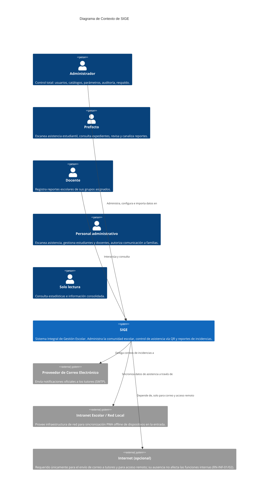
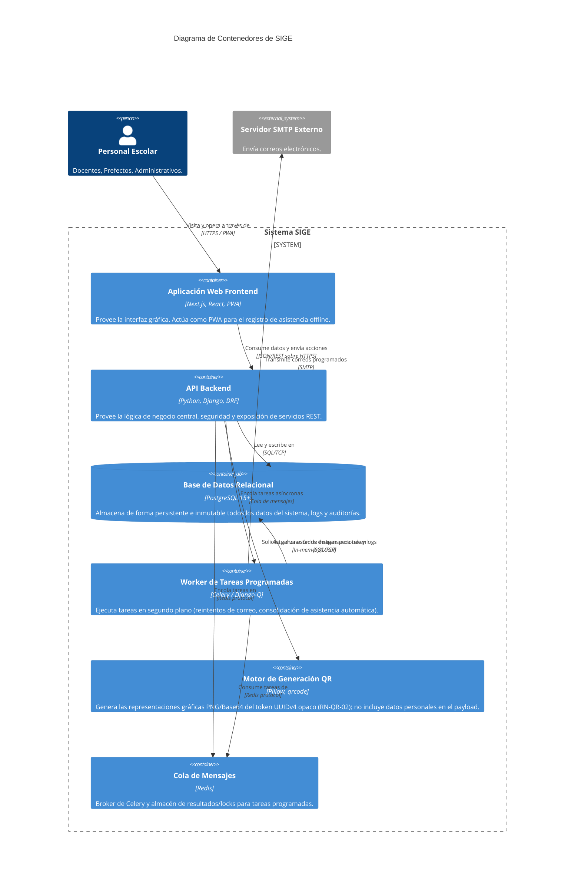

# Documento de Arquitectura SIGE (Modelo C4)
**Sistema Integral de Gestión Escolar**

Este documento describe la arquitectura del software de SIGE utilizando el estándar visual del [Modelo C4](https://c4model.com/), desglosando el sistema desde su contexto macro hasta sus componentes internos.

---

## 1. Nivel 1: Diagrama de Contexto del Sistema
Muestra al sistema SIGE en el centro y las interacciones directas con sus usuarios (actores) y con los sistemas externos de los que depende para funcionar.



---

## 2. Nivel 2: Diagrama de Contenedores
Descompone el sistema SIGE en aplicaciones, almacenes de datos y servicios de ejecución en segundo plano (workers). Muestra las responsabilidades tecnológicas primarias (el *Stack Tecnológico*).



---

## 3. Nivel 3: Diagrama de Componentes (API Backend)
Abre el contenedor de la **API Backend (Django/DRF)** para mostrar sus módulos lógicos internos. Cada componente se ha diseñado para alinearse estrechamente con los prefijos y dominios de las Reglas de Negocio (RN) del sistema.

```mermaid
C4Component
    title Diagrama de Componentes: API Backend Django
    
    Container(frontend, "Frontend PWA", "Next.js", "Interfaz cliente")
    
    Container_Boundary(backend_api, "API Backend (Django)") {
        Component(aut, "Módulo AUT (Autenticación)", "Django Auth, JWT", "Maneja el inicio de sesión, bloqueo por fallos (RN-AUT) y control de acceso.")
        Component(est, "Módulo EST (Estudiantes)", "Django App", "Gestión de alumnos, grupos y tutores (RN-EST).")
        Component(ast, "Módulo AST (Asistencias)", "Django App", Gestión de la ficha del personal docente (alta, edición, desactivación/reactivación, vínculo con cuenta de usuario) y procesamiento y validación de asistencias, estudiantil y docente, incluidas sus ventanas de rebote (RN-AST-01 a 30).")
        Component(qr, "Módulo QR/CRE (Credenciales)", "Django App", "Emisión, validación y revocación de tokens QR únicos (RN-QR).")
        Component(rep, "Módulo REP (Reportes)", "Django App", "Registro de incidencias, canalización y catálogos de faltas (RN-REP).")
        Component(com, "Módulo COM (Comunicaciones)", "Django App", "Motor de plantillas y envío de notificaciones a tutores (RN-COM).")
        Component(imp, "Módulo IMP (Importaciones)", "Django App", "Carga masiva de Excel, validación fila por fila y vistas previas (RN-IMP).")
        Component(adm, "Módulo ADM (Administración)", "Django App", "Control de Parámetros Operativos, Auditoría y Ciclos Escolares (RN-ADM).")
    }

    ContainerDb(db, "PostgreSQL", "Almacenamiento relacional", "")

    Rel(frontend, aut, "Solicita tokens JWT")
    Rel(frontend, imp, "Sube lotes Excel")
    Rel(frontend, ast, "Envía escaneos (online/offline-sync)")
    Rel(frontend, rep, "Crea incidencias")
    
    Rel(aut, db, "Verifica credenciales")
    Rel(est, db, "Lee/Escribe")
    Rel(ast, qr, "Consulta validez del token escaneado")
    Rel(ast, db, "Guarda logs de asistencia")
    Rel(qr, db, "Guarda historial de revocaciones")
    Rel(imp, est, "Delega inserción limpia de alumnos tras validación")
    Rel(rep, com, "Dispara notificación de incidencia grave")
    Rel(com, db, "Registra COMMUNICATION_LOG")
    Rel(adm, db, "Consulta y administra la retención de AUDIT_LOG")
```

---

## 4. Descripción de los Componentes Lógicos del Backend

| Componente | Prefijo RN | Responsabilidad |
|---|---|---|
| **AUT** | `RN-AUT-*` | Emisión y validación de JWT, cifrado de contraseñas, políticas de expiración y bloqueo de seguridad tras intentos fallidos. |
| **EST** | `RN-EST-*` | ABCC (Alta, Baja, Cambio, Consulta) de la población estudiantil y su relación con tutores e información de salud. |
| **AST** | `RN-AST-*` | Algoritmos de determinación de asistencia: cálculos de tolerancias (docentes vs alumnos), ventanas de rebote y validación offline. |
| **QR/CRE** | `RN-QR-*` | Ciclo de vida estricto del Token. Ningún QR se reutiliza; un QR se invalida en el momento en que se emite uno nuevo. Firma de los identificadores opacos (UUIDv4) con la llave secreta. |
| **REP** | `RN-REP-*` | Lógica de estados para el seguimiento de reportes disciplinarios (Registrado -> Revisado -> Autorizado / Canalizado). Control de longitudes. |
| **COM** | `RN-COM-*` | Formateo asíncrono y envío de mensajes hacia los correos de los tutores. Retención de *snapshots* y lógica de reintentos (`COMMUNICATION_LOG`). |
| **IMP** | `RN-IMP-*` | Parsing de archivos Excel (.xlsx), validación de celdas cruzadas (ej. CURP, nombre dividido) sin tocar la base de datos de producción hasta ser confirmada la vista previa. |
| **ADM** | `RN-ADM-*` | Mantenimiento de Catálogos (Tipos de Reporte, Ciclos Escolares) y Parámetros Semilla, además del `AUDIT_LOG` de cada acción sensible que ocurre en los demás módulos. |
