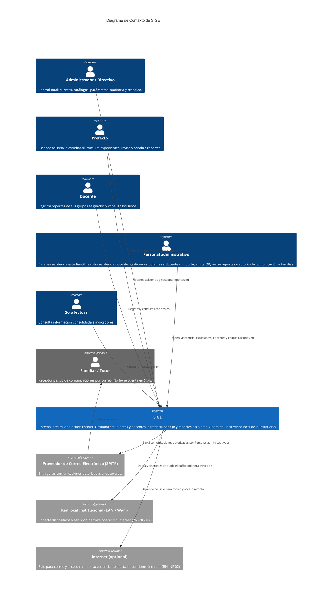
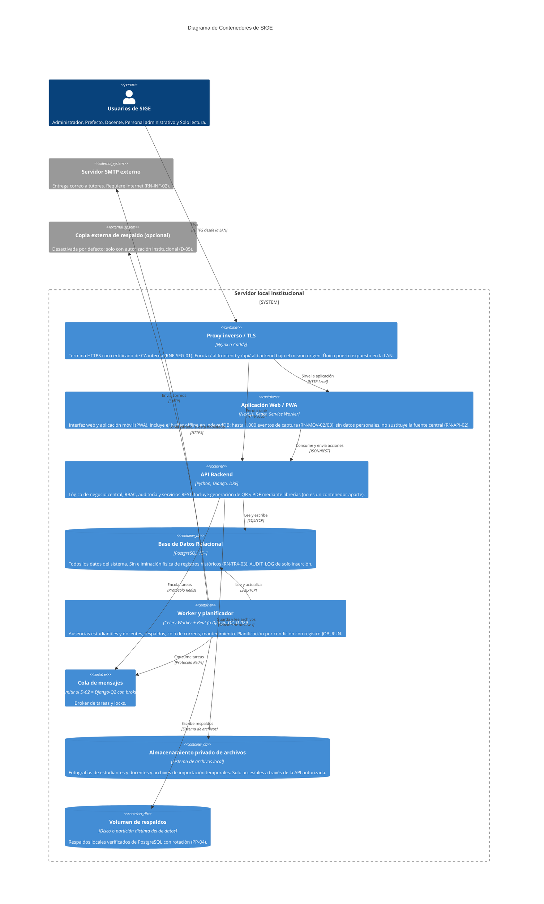
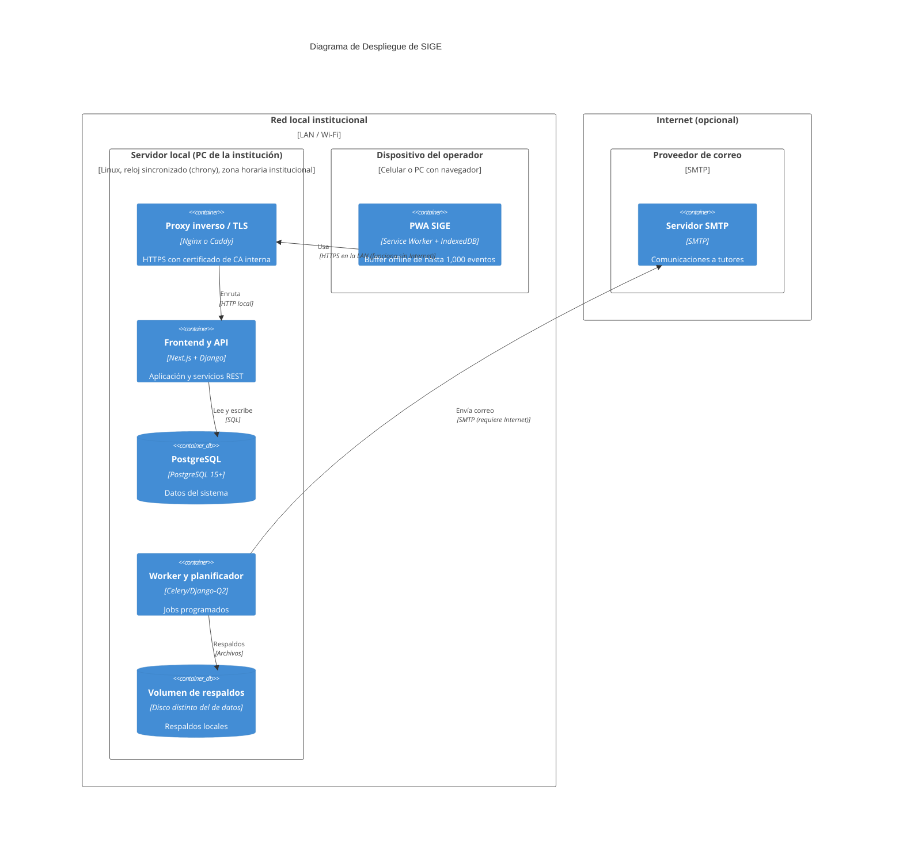

# Documento de Arquitectura SIGE (Modelo C4)
**Sistema Integral de Gestión Escolar**

**Versión:** 2.0 | **Estado:** Para revisión del equipo
**Derivado de:** Acta v10 · RF/RNF v3 · RN v3 · HU v2 · CA v2 · Modelo de Datos v3.0


Este documento describe la arquitectura del software de SIGE utilizando el estándar visual del [Modelo C4](https://c4model.com/), desglosando el sistema desde su contexto macro hasta sus componentes internos.

---

## 1. Nivel 1: Diagrama de Contexto del Sistema
Muestra al sistema SIGE en el centro y las interacciones directas con sus usuarios (actores) y con los sistemas externos de los que depende para funcionar.



---

## 2. Nivel 2: Diagrama de Contenedores
Descompone el sistema SIGE en aplicaciones, almacenes de datos y servicios de ejecución en segundo plano (workers). Muestra las responsabilidades tecnológicas primarias (el *Stack Tecnológico*).



---

## 3. Nivel 3: Diagrama de Componentes (API Backend)
Abre el contenedor de la **API Backend (Django/DRF)** para mostrar sus módulos lógicos internos. Cada componente se ha diseñado para alinearse estrechamente con los prefijos y dominios de las Reglas de Negocio (RN) del sistema.

```mermaid
C4Component
    title Diagrama de Componentes: API Backend Django

    Container(frontend, "Aplicación Web / PWA", "Next.js", "Interfaz cliente")
    Container(worker, "Worker y planificador", "Celery/Django-Q2", "Jobs programados")

    Container_Boundary(backend_api, "API Backend (Django)") {
        Component(core, "Núcleo transversal", "Django", "RBAC por rol (RN-AUT-06), auditoría (RN-AUT-05), errores uniformes (RF-API-04), validadores de nombre (RN-TRX-09), hora efectiva (RN-TRX-04) y estado del sistema.", GET /api/v1/system/status/)
        Component(aut, "Módulo AUT (Autenticación)", "Django Auth, JWT", "Login, sesiones revocables, bloqueo por fallos, recuperación de contraseña (RN-AUT).")
        Component(est, "Módulo EST (Estudiantes)", "Django App", "Expediente, estatus, tutores, consentimiento y datos restringidos por rol (RN-EST).")
        Component(ast, "Módulo AST (Asistencias)", "Django App", "Procesamiento y validación de asistencia estudiantil y docente, ventanas de rebote, reclasificación y sincronización offline (RN-AST-01 a 31). Ficha, programación y vínculo con cuenta de docentes (app teachers).")
        Component(qr, "Módulo QR/CRE (Credenciales)", "Django App", "Emisión, validación, revocación y exportación de tokens QR (RN-QR, RN-CRE).")
        Component(qrlib, "Generador de QR y PDF", "qrcode, Pillow, librería de PDF", "Genera imágenes y PDF de credenciales y stickers. Corre dentro del proceso Django.")
        Component(rep, "Módulo REP (Reportes)", "Django App", "Registro, canalización y trazabilidad de reportes; catálogos de tipo, gravedad y opciones de solo lectura (RN-REP).")
        Component(com, "Módulo COM (Comunicaciones)", "Django App", "Validación de contactos y consentimiento, snapshots, estado de envío y reintentos (RN-COM).")
        Component(imp, "Módulo IMP (Importaciones)", "Django App", "Carga CSV/XLSX, validación fila por fila y vista previa (RN-IMP).")
        Component(adm, "Módulo ADM (Administración)", "Django App", "Parámetros operativos, catálogos editables (grupos, grados, ciclos), asignaciones, indicadores, consulta de AUDIT_LOG y de respaldos (RN-ADM).")
    }

    ContainerDb(db, "PostgreSQL", "Almacenamiento relacional", "")

    Rel(frontend, aut, "Inicia y renueva sesión")
    Rel(frontend, est, "Consulta y edita expedientes")
    Rel(frontend, ast, "Envía escaneos (en línea y sincronización offline)")
    Rel(frontend, qr, "Emite y exporta credenciales")
    Rel(frontend, rep, "Registra y gestiona reportes")
    Rel(frontend, com, "Comunica a familias y reintenta envíos")
    Rel(frontend, imp, "Sube lotes y confirma importaciones")
    Rel(frontend, adm, "Configura parámetros y consulta indicadores")

    Rel(aut, core, "Usa RBAC y auditoría")
    Rel(est, core, "Usa RBAC y auditoría")
    Rel(ast, core, "Usa RBAC, auditoría y hora efectiva")
    Rel(qr, core, "Usa RBAC y auditoría")
    Rel(rep, core, "Usa RBAC y auditoría")
    Rel(com, core, "Usa RBAC y auditoría")
    Rel(imp, core, "Usa RBAC y validadores")
    Rel(adm, core, "Usa RBAC y auditoría")

    Rel(ast, qr, "Consulta validez del token escaneado")
    Rel(qr, qrlib, "Genera imágenes y PDF")
    Rel(imp, est, "Delega la inserción limpia de estudiantes tras la confirmación")
    Rel(rep, com, "Solicita el envío de la comunicación autorizada por PAD")
    Rel(com, est, "Consulta contacto válido y consentimiento del tutor")

    Rel(worker, ast, "Ejecuta verificación de ausencias")
    Rel(worker, com, "Ejecuta envíos y recolector")
    Rel(worker, adm, "Ejecuta respaldos y mantenimiento")

    Rel(core, db, "Escribe AUDIT_LOG (solo inserción)")
    Rel(aut, db, "Sesiones y credenciales")
    Rel(est, db, "Lee y escribe")
    Rel(ast, db, "Guarda asistencia")
    Rel(qr, db, "Guarda tokens y revocaciones")
    Rel(rep, db, "Guarda reportes y transiciones")
    Rel(com, db, "Registra COMMUNICATION_LOG")
    Rel(imp, db, "Lotes y errores de importación")
    Rel(adm, db, "Parámetros y catálogos; consulta AUDIT_LOG sin purga")
```

**Mapeo de módulos a apps Django** (Modelo de Datos §3):

| Componente C4 | Apps Django |
|---|---|
| Núcleo transversal | `audit` (AUDIT_LOG) y paquete `core` |
| AUT | `accounts` |
| EST | `students` |
| AST | `attendance`, `teachers` |
| QR/CRE | `credentials` |
| REP | `reports` |
| COM | `communications` |
| IMP | `imports` |
| ADM | `catalogs`, `settings`, `ops` (BACKUP_LOG, JOB_RUN) |

---

## 4. Descripción de los Componentes Lógicos del Backend

| Componente | Prefijo RN | Responsabilidad |
|---|---|---|
| **Núcleo transversal** | `RN-TRX-*`, `RN-API-*` | RBAC por rol (RN-AUT-06), `AUDIT_LOG` de solo inserción (RN-AUT-05), errores uniformes (RF-API-04), validadores de nombre (RN-TRX-09), hora efectiva (RN-TRX-04), endpoint de estado del sistema. |
| **AUT** | `RN-AUT-*` | Login, JWT de acceso de vida corta y refresh con estado (`USER_SESSION`), *hash* de contraseñas, bloqueo por intentos fallidos, recuperación de contraseña de un solo enlace (RN-AUT-07), gestión de cuentas. |
| **EST** | `RN-EST-*` | Alta, edición y cambio de estatus de estudiantes (`ACTIVO`/`BAJA`/`EGRESADO`, sin eliminación física), tutores con reconocimiento y sincronización entre hermanos (RN-EST-13/14), consentimiento (RN-EST-07/08) y datos de salud/administrativos restringidos por rol (RN-EST-12). |
| **AST** | `RN-AST-*` | Cálculo de estado de asistencia estudiantil y docente (tolerancias, hora de corte), ventanas de rebote, reclasificación (RN-AST-09/24), validación y sincronización de eventos offline. Ficha, programación, desactivación/reactivación y vínculo con cuenta de docentes. Procesos de ausencias (ver Procesos Programados). |
| **QR/CRE** | `RN-QR-*`, `RN-CRE-*` | Ciclo de vida del token (emisión, un solo vigente por persona, revocación, jamás reutilizado). El token es un UUIDv4 opaco resuelto únicamente en BD (sin firma). Exportación de credenciales completas y stickers (PNG/PDF). |
| **REP** | `RN-REP-*` | Registro y trazabilidad de reportes: `REGISTRADO → REVISADO_PREFECTO → CANALIZADO → REVISADO_ADMINISTRATIVO → AUTORIZADO/COMUNICADO/RESUELTO`, más `RECHAZADO`. Observación de 50 a 100 caracteres. Catálogos de tipo, gravedad y opciones de solo lectura (RN-ADM-03). |
| **COM** | `RN-COM-*` | Validación previa al envío (contacto válido con correo, consentimiento no `REVOCADO`), `content_snapshot` mínimo, estado de cada intento (`PENDIENTE`/`ENVIADO`/`FALLIDO`) y reintentos. Se activa solo tras la autorización de Personal administrativo (RN-REP-04). |
| **IMP** | `RN-IMP-*` | Carga de archivos CSV y XLSX, validación fila por fila con nombres en columnas separadas (RN-IMP-09, sin separar nunca un nombre completo), vista previa sin persistir estudiantes, confirmación por fila (RN-IMP-04/07). Los archivos temporales viven en el almacén privado. |
| **ADM** | `RN-ADM-*` | Parámetros operativos (RN-ADM-02), catálogos editables (grupos, grados, ciclos) y asignaciones prefecto–grupo y docente–grupo, indicadores, consulta de `AUDIT_LOG` y de respaldos. No administra los catálogos `REPORT_*` (fijos, RN-ADM-03). |

## 5. Diagrama de Despliegue


**Qué funciona sin Internet (RN-INF-01):** asistencia estudiantil y docente, reportes, consultas, importación, respaldos locales y ausencias automáticas. **Qué depende de Internet (RN-INF-02):** envío de correo (incluido restablecimiento de contraseña), copia externa opcional de respaldos y acceso remoto (fuera de alcance). **Pérdida de la LAN** (el dispositivo no alcanza el servidor) activa el modo offline de la PWA (US-032); es un escenario distinto de la pérdida de Internet y se prueba por separado (Acta).

## 6. Atributos de calidad y decisiones arquitectónicas

| RNF | Decisión arquitectónica |
|---|---|
| RNF-DES-01 (QR < 250 ms) | El endpoint de escaneo solo hace trabajo síncrono mínimo: búsqueda indexada del token (`UNIQUE`), consulta del registro del día (`UNIQUE(student_id, record_date)`), inserción. Auditoría ligera, correo y cualquier trabajo pesado quedan fuera de la ruta crítica (worker). |
| RNF-DES-02 (N escaneos/min) | Dimensionar procesos del servidor de aplicación con la `N` que defina la institución; probar en el piloto (Hito 06). |
| RNF-SEG-01 | Proxy inverso con TLS y CA interna (SG-07). |
| RNF-FIA-01 | Buffer offline en la PWA definido en C4-04 y SG-09. |
| RNF-FIA-02/03, RNF-POR-01 | Respaldos verificados con rotación y restauración probada (PP-04); runbook de instalación reproducible en equipo de reemplazo. |
| RNF-FIA-04 | NTP/chrony y procedimiento manual sin Internet (PP-09). |
| RNF-MAN-01/02 | Documentación en Git; lógica de negocio solo en Django (RN-TRX-05). |

**Decisiones (ADR)**

| ADR | Decisión | Estado |
|---|---|---|
| ADR-01 | **La "aplicación móvil" es la PWA de Next.js.** Coherente con el stack base del Acta (TypeScript, Next.js). Limitaciones a validar en RNF-COM-02: iOS/Safari no soporta *Background Sync* (la sincronización offline debe iniciarse con la app abierta), el almacenamiento local puede ser purgado por el navegador tras un periodo sin uso, y la cámara exige contexto seguro (HTTPS). | Propuesta |
| ADR-02 | Motor de tareas: Celery+Redis o Django-Q2 (ORM), recomendado Django-Q2 (D-02). | Pendiente |
| ADR-03 | HTTPS en LAN con CA interna (D-09). | Propuesta |
| ADR-04 | Sesión con access token de 15 min + refresh opaco con rotación en cookie HttpOnly (SG-01, D-08). | Propuesta |
| ADR-05 | Archivos (fotografías, importaciones) en almacén privado servido solo por la API autorizada (RN-TRX-02). | Propuesta |
